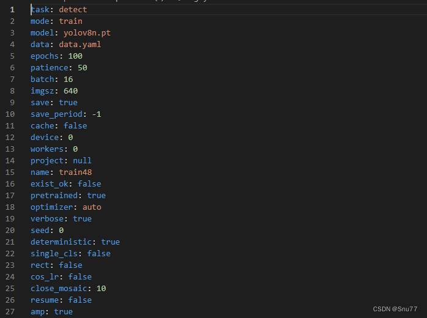
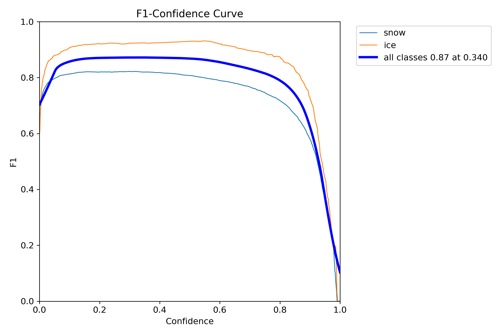
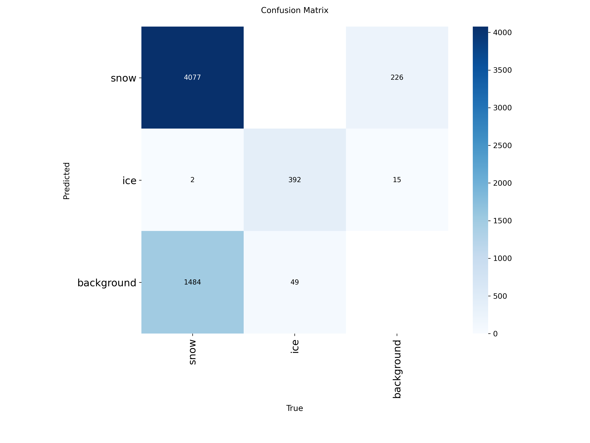
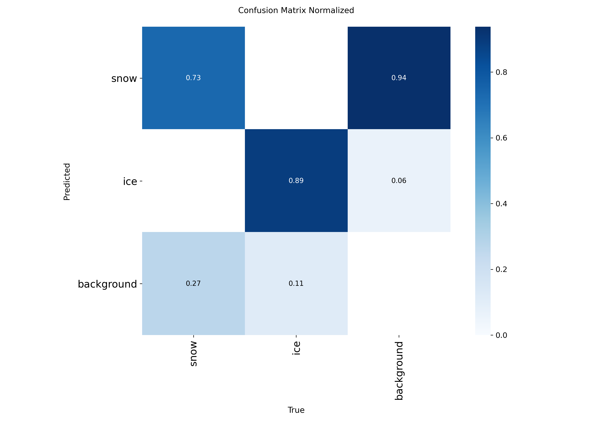
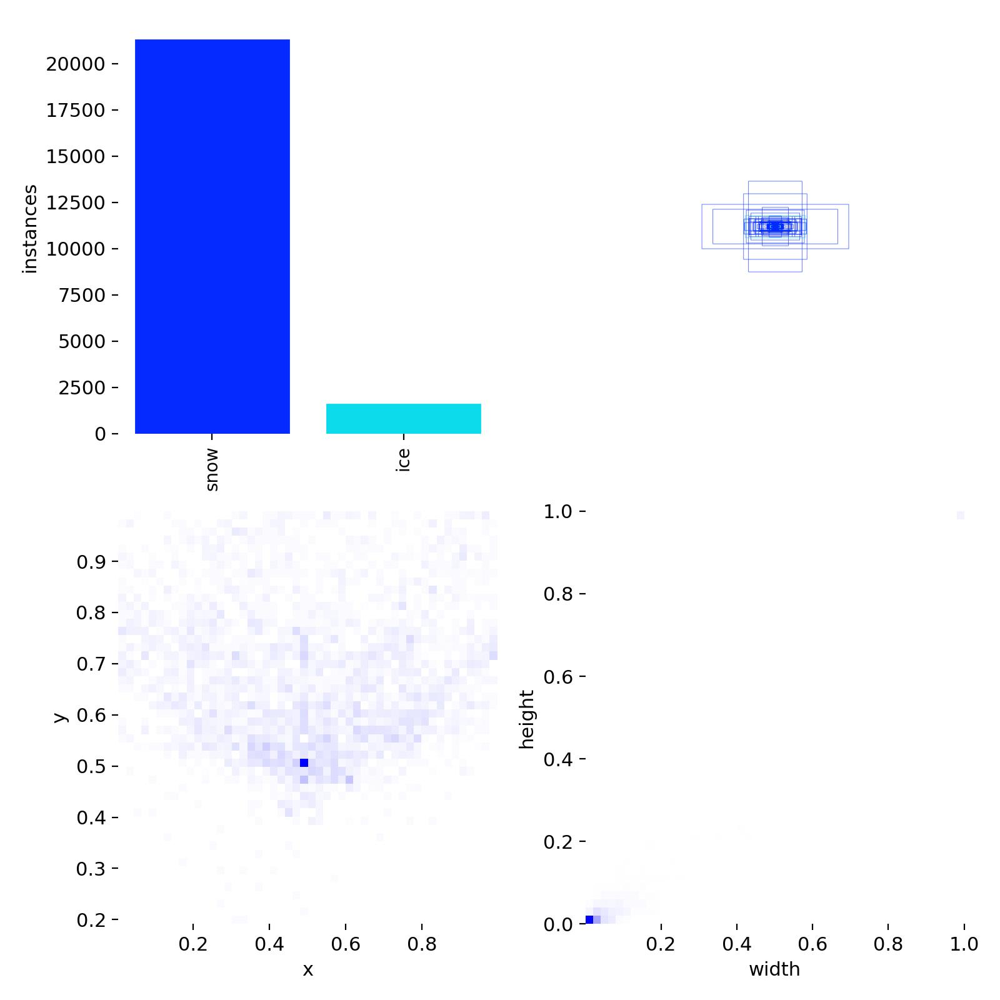
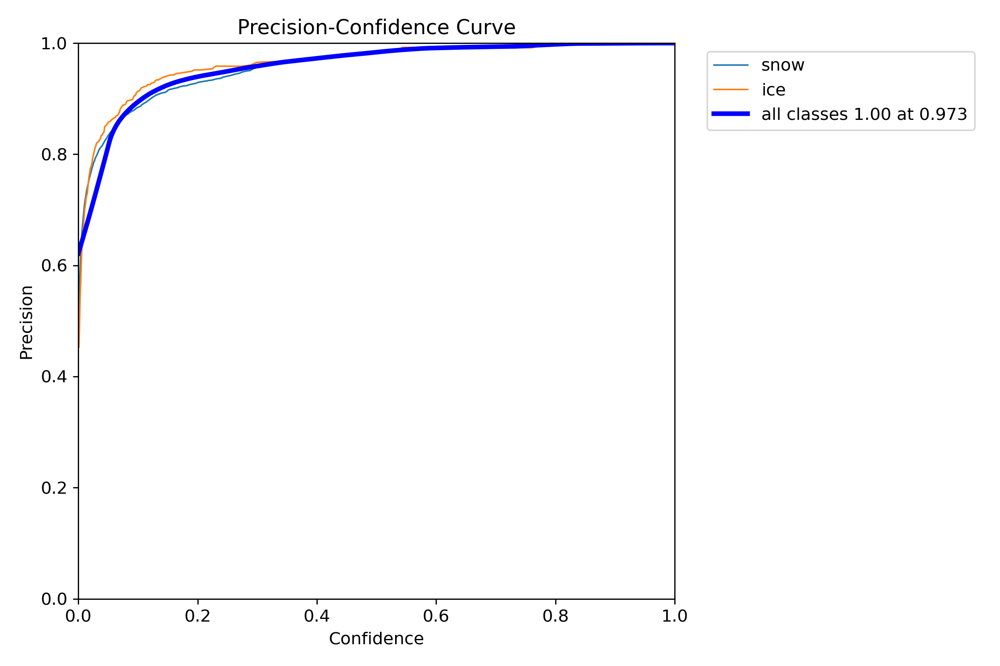
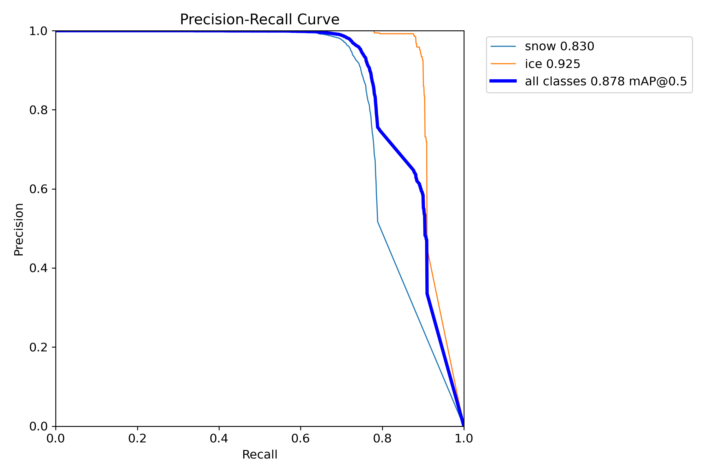
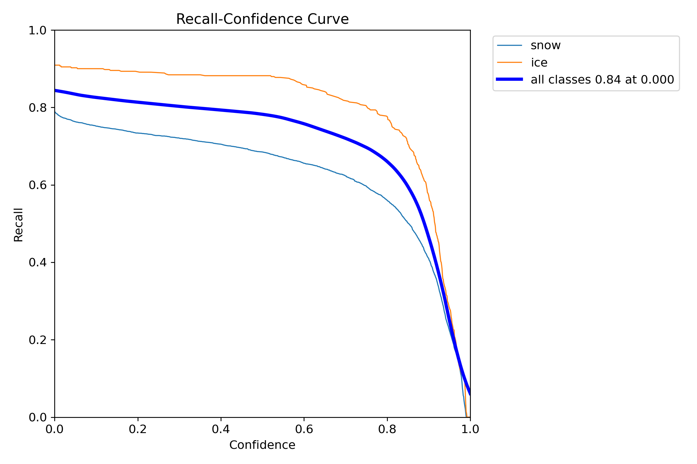
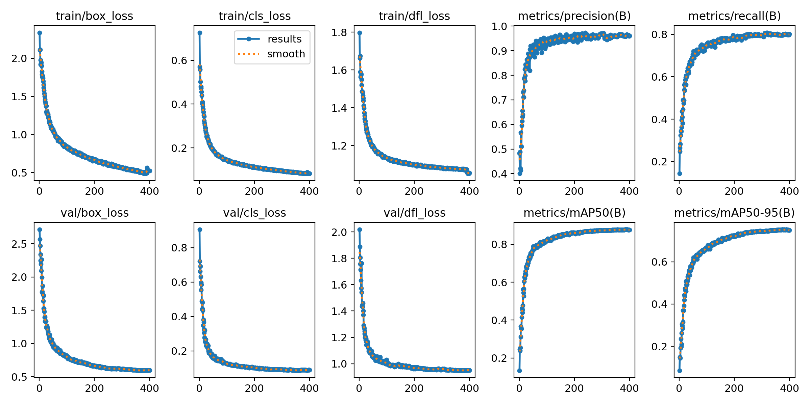

# 基于yolov11m物体检测模型的前端展示项目

## 大纲

- 基于yolov11m和机器视觉的冰雪检测模型
- 选择自动划分数据集为训练集和验证集。

## 环境配置

```bash
pip pip install -r .\requirements.txt
```

##  项目目录配置

```bash
PS E:\education\road_snow> tree 
卷 龙版 的文件夹 PATH 列表
卷序列号为 64E0-4EF7
E:.
├─.idea
│  └─inspectionProfiles
├─training_set
│  ├─images
│  └─labels
├─yolov11m
│  └─runs
│      └─detect
│          ├─predict
│          ├─snow_v5_largefocus6
│          │  └─weights
│          ├─train38
│          │  └─weights
│          ├─yolov11m_snow_large
│          │  └─weights
│          └─yolov11m_snow_large4
│              └─weights
└─工作报告
    └─assets
```

## 识别对象分类

训练决定舍弃数据集中背景和干燥这两大类，只选择snow和ice这三类。目的是只为识别冰雪，增强模型识别的针对性。

| 类型 | 危险指数 |
| ---- | -------- |
| snow | 中度危险 |
| ice  | 高度危险 |


## 数据集

### 数据集划分

把数据集集中在`./training_set`下， 使用`ultralytics.data.split.autosplit`命令随机自动划分数据集。可以不划分

```python
ultralytics.data.split.autosplit(self.image_output_dir,weights=(0.8, 0.2, 0.0),annotated_only=True)
```


### 数据集目录结构

```bash
PS E:\education\dataset> tree
卷 龙版 的文件夹 PATH 列表
卷序列号为 64E0-4EF7
E:.
├─12.01
├─json_dataset #图片和标注图片的json文件
│  ├─12.02
│  ├─157
│  ├─158
│  ├─159
│  ├─160
│  ├─161
│  ├─162
│  ├─163
│  ├─164
│  ├─165
│  ├─166
│  ├─167
│  ├─168
│  ├─169
│  ├─170
│  ├─171
│  ├─172
│  ├─173
│  ├─174
│  ├─175
│  ├─176
│  ├─177
│  ├─178
│  ├─179
│  ├─180
│  ├─181
│  ├─182
│  ├─183
│  ├─184
│  ├─185
│  ├─186
│  ├─187
│  ├─188
│  ├─189
│  ├─190
│  ├─191
│  ├─192
│  ├─193
│  ├─194
│  ├─195
│  ├─196
│  ├─197
│  ├─198
│  ├─199
│  ├─200
│  ├─201
│  ├─202
│  ├─203
│  ├─204
│  ├─205
│  ├─206
│  ├─208
│  └─209
├─pure_dataset #纯态数据，即一整张图片中都是冰或雪的图片。
│  ├─labels
│  ├─冰
│  ├─干燥
│  ├─潮湿
│  ├─积水
│  └─雪
└─text_dataset 
    ├─测试集
    ├─测试集_自己拍的图片 #自己找的一些用于测试的图片
    └─视频测试集 #视频
```

### `yolov11m.yaml`配置

添入了数据增强参数，用来提升模型的鲁棒性。

```yaml
path: ../training_set
train:  autosplit_train.txt
val:    autosplit_val.txt

nc: 2
names: ['snow', 'ice']

# 数据增强专项配置（侧重召回率优化）
augmentations:
  # === 大目标检测优化 ===
  mosaic: 1.0           # 全程开启（提供多尺度上下文）
  mixup: 0.2            # 提高 MixUp 比例（增强泛化能力）
  copy_paste: 0.2       # 增加小目标复制（提升小目标召回）
  degrees: 10.0         # 扩大旋转范围（增强姿态鲁棒性）
  scale: [0.95, 1.2]    # 放宽缩放范围（覆盖更多目标尺寸）
  translate: 0.15       # 增加平移（提升边缘目标检测）
  
  # === 小目标与边界优化 ===
  perspective: 0.001    # 轻微透视（模拟不同视角）
  shear: 0.05           # 小幅剪切（丰富目标形状变化）
  hsv_h: 0.03           # 增加色调变化（适应不同光照）
  hsv_s: 0.6            # 增强饱和度（突出雪/冰特征）
  hsv_v: 0.4            # 调整亮度（适应不同光照条件）
  
  # === 大目标专用配置 ===
  overlap_mask: True    # 增强掩模重叠处理（针对大面积目标）
  mask_ratio: 0.3       # 掩模比例（保留更多目标细节）
  
  # === 锚点优化 ===
  #anchors:
    #- [128,128, 256,256, 384,384]  # 增加中等尺寸锚点（平衡大小目标）
    #- [512,512, 768,768, 1024,1024]  # 新增超大型锚点（覆盖极大目标）
  
  # === 训练稳定性 ===
  fliplr: 0.7           # 增加水平翻转概率
  flipud: 0.3           # 少量垂直翻转（适应特殊场景）
  
  # === 后处理优化 ===
  iou_t: 0.65           # NMS IoU 阈值（提高到 0.65，保留更多重叠框）
  conf_t: 0.05          # 置信度阈值（降低到 0.05，减少漏检）
```


## 数据集标注

### 标注纯态数据集

#### 需求

- 需要为Yolo机器学习标注数据集，有以下数据集：moist 、snow和ice三种。需要实现数据集标注。返回图片对应的yolo的.txt标注文件。
- 现在有一些纯态图片，就是整张图片区域都是moist、snow或ice中的一种。

- 标注方法的话，纯态代表整张图片，所以对应的`label.txt`就是 `<class_id> 0.5 0.5 1.0 1.0`

- 再把标注过的图片移动到训练集下，

  ```bash
  PS E:\education\road_snow\training_set> Get-ChildItem | Format-Table FullName
  
  FullName
  --------
  E:\education\road_snow\training_set\images
  E:\education\road_snow\training_set\labels
  E:\education\road_snow\training_set\autosplit_train.txt
  E:\education\road_snow\training_set\autosplit_val.txt
  E:\education\road_snow\training_set\labels.cache
  ```


### 标注普通数据集

#### 需求

- 是图片文件和它对应的json标注文件，需要把这些.json标注转为.txt。之后在分别复制到训练集下。

  ```bash
  PS D:\Program Files\数据集\PNG\12.02> ls
  
  
      目录: D:\Program Files\数据集\PNG\12.02
  
  
  Mode                 LastWriteTime         Length Name
  ----                 -------------         ------ ----
  -a----         2025/1/20     17:42        8872155 IMG_0721.json
  -a----         2025/1/20     17:44        6337944 IMG_0721.PNG
  -a----         2025/1/20     17:49        8872155 IMG_0722.json
  -a----         2025/1/20     17:48        6392482 IMG_0722.PNG
  -a----         2025/1/20     17:51        8872155 IMG_0723.json
  -a----         2025/1/20     17:46        6293090 IMG_0723.PNG
  -a----         2025/1/20     17:56        8872155 IMG_0724.json
  ......(省略)
  ```

### 代码实现

```python
#dataprocessor.py 在要生成训练集的目录下执行即可
import os
import json
import shutil
from ultralytics.data.split import autosplit

class dataprocessor:
    def __init__(self, image_dir, label_output_dir, image_output_dir):
        self.image_dir = image_dir
        self.label_output_dir = label_output_dir
        self.image_output_dir = image_output_dir
        os.makedirs(self.label_output_dir, exist_ok=True)
        os.makedirs(self.image_output_dir, exist_ok=True)
        self.suffix_file =  [".PNG",".JPG",".JPEG",".jpg",".png",".jpeg"]  # 支持的图片后缀
        self.classes = {"ice": 1,"snow": 0}  # 定义类别列表，顺序与 class_id 一致

        
    # 解析 JSON 并转换为 YOLO 格式
    def convert_to_yolo(self,json_file, img_width, img_height):
        with open(json_file, "r") as f:
            data = json.load(f)

        yolo_labels = []
        for shape in data['shapes']:
            if shape['shape_type'] == 'polygon':
                label = shape['label']
                if label not in self.classes:
                    continue
                class_id = self.classes[label]

                # 计算多边形的外接矩形
                points = shape['points']
                x_coords = [p[0] for p in points]
                y_coords = [p[1] for p in points]
                x_min, x_max = min(x_coords), max(x_coords)
                y_min, y_max = min(y_coords), max(y_coords)

                # 转换为 YOLO 格式
                x_center = (x_min + x_max) / 2 / img_width
                y_center = (y_min + y_max) / 2 / img_height
                width = (x_max - x_min) / img_width
                height = (y_max - y_min) / img_height
                yolo_labels.append(f"{class_id} {x_center} {y_center} {width} {height}")

        return yolo_labels # 返回一个字符串

    # 保存图片和标签到相应的输出目录
    def save_data(self,img_file, labels):
        
        base_name = os.path.splitext(os.path.basename(img_file))[0] # 获取文件名不带扩展名
        for i in self.suffix_file:
            if os.path.basename(img_file).endswith(i):
                img_output_path = os.path.join(self.image_output_dir, f"{base_name}{i}")
                break
        label_output_path = os.path.join(self.label_output_dir, f"{base_name}.txt")

        with open(label_output_path, "w") as f:
            f.write("\n".join(labels))

        # 复制图片
        shutil.copy(img_file, img_output_path)

    # 遍历目录下的所有图片文件进行json转换txt并保存
    def traveldir_solve_json(self,dir_path):
        dir_name_lis = os.listdir(dir_path)
        for dir_name in dir_name_lis:
            for img_file in os.listdir(os.path.join(dir_path, dir_name)):
                for i in self.suffix_file:
                    if img_file.endswith(i):
                        json_file = os.path.join(dir_path, dir_name, os.path.splitext(img_file)[0] + ".json")
                        if os.path.exists(json_file):#如果存在对应的json则操作
                            # 假设图片分辨率为 2400x1600，可以根据实际情况调整
                            img_width, img_height = 2400, 1600
                            labels = self.convert_to_yolo(json_file, img_width, img_height)
                            self.save_data(os.path.join(dir_path, dir_name, img_file), labels)
                            break
        print("json解析转换保存流程已完成！")
    
    def traveldir_solve_pure(self,dir_path):
        # 遍历所有类别的图片
        for category, dir_path in dir_path.items():
            class_id = self.classes[category]
            all_images = [f for f in os.listdir(dir_path) if f.endswith(('.jpg', '.png', '.jpeg', '.JPG', '.PNG', '.JPEG'))]

            # 处理训练集
            for filename in all_images:
                src_img_path = os.path.join(dir_path, filename)
                dst_img_path = os.path.join(self.image_output_dir, filename)

                # 复制图片
                shutil.copy(src_img_path, dst_img_path)

                # 生成标签
                label_filename = os.path.splitext(filename)[0] + ".txt"
                label_path = os.path.join(self.label_output_dir, label_filename)
                with open(label_path, "w") as f:
                    f.write(f"{class_id} 0.5 0.5 1.0 1.0\n")
        print("dataset划分完成！")

    def split_train_val(self):
        # 划分训练集和验证集
        autosplit(self.image_output_dir,weights=(0.8, 0.2, 0.0),annotated_only=True)
        print("训练集和验证集划分完成！")

# 设置路径全局变量
json_image_dir = "E:/education/dataset/json_dataset"  # json标注好的原始图片数据集的目录
json_label_output_dir = "training_set/labels"
json_image_output_dir = "training_set/images"

# 处理json标注好的图片数据集
dataprocessor_json = dataprocessor(image_dir=json_image_dir,label_output_dir=json_label_output_dir,image_output_dir=json_image_output_dir)
dataprocessor_json.traveldir_solve_json(json_image_dir)  # 执行json解析转换保存流程

# 处理纯图片数据集
pure_base_dirs = {
    "ice": "E:/education/dataset/pure_dataset/ice",
    "snow": "E:/education/dataset/pure_dataset/snow"
}
dataprocessor_pure = dataprocessor(image_dir=pure_base_dirs,label_output_dir=json_label_output_dir,image_output_dir=json_image_output_dir)
dataprocessor_pure.traveldir_solve_pure(pure_base_dirs)  # 执行dataset划分流程

# 划分训练集和验证集
dataprocessor_pure.split_train_val()  # 执行训练集和验证
```


## 模型训练

创建训练目录`yolov11m`，在该目录下创建`train.py`文件

```python
import torch
from ultralytics import YOLO

def main():
    # 初始化模型（加载预训练权重）
    model = YOLO(r"yolo11m.pt")

    # 训练参数配置（大目标召回率优化版）
    train_args = {
        # ===== 数据配置 =====
        'data': 'yolov11m.yaml',  # 数据集配置文件路径
        
        # ===== 核心训练参数 =====
        'epochs': 600,       # [100-300] 总训练轮次。调大：更充分学习大目标特征；调小：可能欠拟合
        'batch': -1,         # [8-32] 批次大小。调大：稳定训练但需更大显存；调小：适合高分辨率训练
        'imgsz': 1280,        # [640-1280] 输入分辨率。调大：提升大目标细节捕捉能力；调小：加快训练速度
        'device': '0',       # 使用GPU训练
        
        # ===== 优化器配置 =====
        'optimizer': 'AdamW',# 优化器选择。AdamW适合小批量数据，SGD更适合大批量
        'lr0': 0.0007,        # [0.0005-0.002] 初始学习率。调大：加速收敛但可能震荡；调小：稳定但收敛慢
        'lrf': 0.001,         # [0.005-0.05] 最终学习率=lr0*lrf。调大：更快衰减；调小：保持后期学习能力
        'weight_decay': 0.005,# [0.001-0.01] 权重衰减。调大：防止过拟合；调小：模型容量更大
        
        # ===== 损失函数权重 =====
        'box': 12.0,         # [7.0-15.0] 定位损失权重。调大：增强大目标框体回归；调小：侧重分类任务
        'cls': 0.2,          # [0.3-1.0] 分类损失权重。调大：提高分类精度；调小：降低误检惩罚
        'dfl': 2.0,          # [1.5-2.5] 分布焦点损失。调大：提升边界预测；调小：降低分布约束
        
        # ===== 训练策略 =====
        'warmup_epochs': 15, # [10-20] 学习率预热。调大：稳定大目标初期学习；调小：快速进入正常训练
        'label_smoothing': 0.1,# [0.0-0.2] 标签平滑。调大：防止过拟合；调小：保持原始标签置信度
        'close_mosaic': 10,  # [10-20] 最后关闭mosaic的轮次。调大：更晚关闭增强；调小：提前稳定训练
        'patience': 20,      # [20-50] 早停等待。调大：给大目标充分收敛时间；调小：快速停止
        
        # ===== 工程优化 =====
        'workers': 0,        # Windows必须设为0
        'amp': True,         # 混合精度训练。节省30%显存
        'project': 'runs/detect',
        'name': 'yolov11m_snow_large',  # 项目名称
        
        # ===== 高级配置 =====
        'overlap_mask': True,  # 增强掩模重叠处理（针对大面积目标）
        'dropout' : 0.05,  # [0.0-0.1] Dropout率。调大：防止过拟合；调小：保持模型容量

    }

    # 打印配置
    print("============ 训练配置 ============")
    for k, v in train_args.items():
        print(f"{k:20s} : {v}")

    # 启动训练
    results = model.train(**train_args)

if __name__ == "__main__":
    torch.multiprocessing.freeze_support()
    main()
    print("============ 训练完成 ============")
```


## 危险评估算法设计

面向对象设计的，可作为后端文件导入使用

```python
#DangerDetectApi.py
from shapely.geometry import box
import cv2
from ultralytics import YOLO
from typing import Tuple
import numpy as np

class DangerDetector:
    """路面危险评估API核心类(精确面积计算版)"""

    def __init__(self, model_path: str, conf_threshold: float = 0.5):
        self.model = YOLO(model_path)
        self.conf_threshold = conf_threshold
        self.class_map = {0: "snow", 1: "ice"}
        self.priority = {"ice": 3, "snow": 2, "water": 1}
        self.messages = {
            "ice": "⚠️ 路面存在结冰区域，请保持车距并使用防滑链！",
            "snow": "❄️ 路面存在积雪，请保持车距！",
            "water": "💧 路面湿滑，建议减速慢行！",
            "safe": "✅ 路面状况安全，可正常行驶"
        }

    def _calculate_danger_level(self, results, image_width: int, image_height: int) -> Tuple[str, str]:
        """优化后的危险评估算法"""
        detections = []
        if results.boxes:
            boxes = results.boxes.cpu().numpy()
            for i in range(len(boxes.xyxy)):
                x1, y1, x2, y2 = boxes.xyxy[i]
                conf = boxes.conf[i]
                cls_id = int(boxes.cls[i])
                area = (x2 - x1) * (y2 - y1)
                detections.append({
                    "class": self.class_map[cls_id],
                    "coords": (x1, y1, x2, y2),
                    "confidence": conf,
                    "area": area
                })

        # 优化排序逻辑
        sorted_detections = sorted(
            detections,
            key=lambda x: (
                -self.priority.get(x["class"], 0),
                -x["area"],
                -x["confidence"]
            )
        )

        # 精确面积计算逻辑
        covered_areas = []
        ice_area = snow_area = water_area = 0

        for detection in sorted_detections:
            cls = detection["class"]
            x1, y1, x2, y2 = detection["coords"]
            current_box = box(x1, y1, x2, y2)
            current_polygon = current_box

            # 计算有效未覆盖区域
            valid_area = current_polygon
            for existing in covered_areas:
                if valid_area.intersects(existing["geometry"]):
                    valid_area = valid_area.difference(existing["geometry"])
            
            effective_area = valid_area.area

            if effective_area > 0:
                # 扣除被覆盖区域的面积
                for existing in covered_areas:
                    if current_polygon.intersects(existing["geometry"]):
                        overlap = existing["geometry"].intersection(current_polygon)
                        if overlap.area > 0:
                            if existing["class"] == "ice":
                                ice_area -= overlap.area
                            elif existing["class"] == "snow":
                                snow_area -= overlap.area
                            elif existing["class"] == "water":
                                water_area -= overlap.area

                # 添加新区域面积
                if cls == "ice":
                    ice_area += effective_area
                elif cls == "snow":
                    snow_area += effective_area
                elif cls == "water":
                    water_area += effective_area

                # 合并覆盖区域
                new_geometry = current_polygon
                for existing in covered_areas:
                    if new_geometry.intersects(existing["geometry"]):
                        new_geometry = new_geometry.union(existing["geometry"])
                covered_areas.append({
                    "class": cls,
                    "geometry": new_geometry,
                    "confidence": detection["confidence"]
                })

        # 后续逻辑保持不变
        total_pixels = image_width * image_height
        weighted_ice = ice_area 
        weighted_snow = snow_area 
        weighted_water = water_area 
        danger_value = (weighted_ice + weighted_snow + weighted_water) / total_pixels
        
        thresholds = {
            "high": 0.7 ,
            "medium": 0.4 ,
            "low": 0.2 
        }

        if danger_value >= thresholds["high"]:
            danger_level = "高度危险"
        elif danger_value >= thresholds["medium"]:
            danger_level = "中度危险"
        elif danger_value >= thresholds["low"]:
            danger_level = "轻度危险"
        else:
            danger_level = "安全"

        dominant_class = max(
            ["ice", "snow", "water"],
            key=lambda x: (ice_area, snow_area, water_area)[["ice", "snow", "water"].index(x)]
        )
        message = self.messages[dominant_class] if danger_level != "安全" else self.messages["safe"]
        
        return danger_level, message

    # 保持原有predict方法不变
    
    def predict_from_image(self, image_path: str) -> dict:
        """
        从图片文件路径进行预测
        :param image_path: 图片文件路径
        :return: 包含危险等级和提示信息的字典
        """
        results = self.model.predict(
            source=image_path,
            save=True,
            conf=self.conf_threshold
        )

        # 获取图片尺寸
        img = results[0].orig_img
        h, w = img.shape[:2]

        # 计算危险等级
        danger_level, message = self._calculate_danger_level(results[0], w, h)

        return {
            "danger_level": danger_level,
            "message": message,
            "image_size": (w, h),
            "results": results
        }

    def predict_from_array(self, image_array : np.ndarray) -> dict:
        """
        从numpy数组进行预测
        :param image_array: 输入图像数组 (HWC格式)
        :return: 包含危险等级和提示信息的字典
        """
        results = self.model.predict(
            source=image_array,
            save=False,
            conf=self.conf_threshold
        )

        # 获取图片尺寸
        h, w = image_array.shape[:2]

        # 计算危险等级
        danger_level, message = self._calculate_danger_level(results[0], w, h)

        return {
            "danger_level": danger_level,
            "message": message,
            "image_size": (w, h),
            "results": results
        }

```

使用示例：

`main.py`

```python
from DangerDetectApi import DangerDetector

model_path = r"E:\education\road_snow\yolov11m\runs\detect\yolov11m_snow_large4\weights\best.pt" 
conf_threshold = 0.2 # 置信度阈值

# 初始化检测器
detector = DangerDetector(model_path,conf_threshold)

# 从文件路径预测
while True:
    # 输入图片路径
    image_path = input("请输入图片路径（输入exit或按ctrl + c退出）：")
    if image_path.lower() == "exit":
        break
    
    image_path = image_path.replace("\\", "/").replace("\"","")  # 替换反斜杠为正斜杠
    # 进行预测
    result = detector.predict_from_image(image_path)
    print(result['danger_level'], result['message'])
```


## 模型评估与优化

### 训练结果

# YOLOV11训练结果分析 


## 前置概念

### 评估目标检测性能的指标

评估目标检测性能指标通常涉及以下步骤：

准确率（Accuracy）:表示正确预测的目标数量与总预测数量的比率。

精确率（Precision）:表示模型正确预测为正样本的样本数量占所有预测为正样本的样本数量的比例。

召回率（Recall）:表示模型正确预测为正样本的样本数量占所有实际正样本的样本数量的比例。

[F1分数（F1 Score）](https://blog.csdn.net/zjn295771349/article/details/84961596):综合考虑精确率和召回率，是精确率和召回率的调和平均数。在深度学习中，F1分数是一种常用的评估指标，用于**衡量模型的准确性和召回率**。 它的最大值是1，最小值是0，值越大意味着模型越好。

IoU（Intersection over Union）:衡量模型检测出的区域与实际目标区域的重叠程度。

平均精度（Average Precision，AP）:在目标检测中，AP通常指Precision-Recall曲线下的面积，用于综合评估模型的性能。

mAP（mean Average Precision）:多类别目标检测任务中，各类别的AP的平均值。

漏检率（Miss Rate）:表示模型未能检测到的目标数量占所有实际正样本的比例。

虚警率（False Alarm Rate）:表示模型错误地将负样本预测为正样本的数量占所有负样本的比例。

前向传播时间（Inference Time）:模型进行一次前向传播所需的时间。

每秒帧数（Frames Per Second，FPS）:描述模型在单位时间内能够处理的帧数。


## 训练结果分析

#### 目录结构

```powershell
yolov11m_snow_large4(根目录)
            │  args.yaml
            │  BoxF1_curve.png
            │  BoxPR_curve.png
            │  BoxP_curve.png
            │  BoxR_curve.png
            │  confusion_matrix.png
            │  confusion_matrix_normalized.png
            │  labels.jpg
            │  results.csv
            │  results.png
            │  train_batch0.jpg
            │  train_batch1.jpg
            │  train_batch2.jpg
            │  train_batch46800.jpg
            │  train_batch46801.jpg
            │  train_batch46802.jpg
            │  val_batch0_labels.jpg
            │  val_batch0_pred.jpg
            │  val_batch1_labels.jpg
            │  val_batch1_pred.jpg
            │  val_batch2_labels.jpg
            │  val_batch2_pred.jpg
            │
            └─weights
                    best.pt
                    last.pt
```

#### args.yaml

第二个文件是args.yaml文件,其中主要保存一些我们训练时指定的参数，内容如下所示。




#### F1_curve




#### confusion_matrix_normalized



confusion_matrix_normalized图：揭示了混淆矩阵中实例的数量


####  confusion_matrix_normalized



confusion_matrix_normalized图：揭示了验证集中snow的召回率达到了73%，ice达到了89%


#### labels




#### P_curve



P_curve图：在较低置信度下即可得到较高的准确率，表明模型对目标的识别准确性较高。


#### PR_curve




#### R_curve

#### 

在该图表中，曲线越靠近右上角，则表示模型的性能越好。当曲线接近图表的右上角时，意味着模型在保持高召回率的同时，也能够保持较高的精确度。因此，R_curve.png可以用于评估模型的整体表现和找到一个合适的阈值，来平衡模型的召回率和精确度。




#### results.csv

该文件为以表格形式（CSV 格式）保存的结果数据，通常包含了模型在训练、验证等阶段各项关键指标（如准确率、精确率、召回率、F1 值等）的具体数值，每行对应不同的训练轮次、不同数据集（训练集、验证集等）和不同的评估时间点等，方便进一步用数据处理工具对结果进行详细分析、统计以及对比等操作。

| epoch | time    | train/box_loss | train/cls_loss | train/dfl_loss | metrics/precision(B) | metrics/recall(B) | metrics/mAP50(B) | metrics/mAP50-95(B) | val/box_loss | val/cls_loss | val/dfl_loss | lr/pg0   | lr/pg1   | lr/pg2   |
| ----- | ------- | -------------- | -------------- | -------------- | -------------------- | ----------------- | ---------------- | ------------------- | ------------ | ------------ | ------------ | -------- | -------- | -------- |
| 1     | 300.274 | 2.33732        | 0.72657        | 1.7974         | 0.48271              | 0.14403           | 0.13421          | 0.08573             | 2.71293      | 0.90541      | 2.01789      | 0.093435 | 4.63E-05 | 4.63E-05 |
| 2     | 599.912 | 2.10881        | 0.57016        | 1.66299        | 0.40036              | 0.26467           | 0.24603          | 0.14702             | 2.56651      | 0.72092      | 1.88857      | 0.086815 | 9.27E-05 | 9.27E-05 |
| 3     | 899.066 | 2.11586        | 0.55809        | 1.6736         | 0.48793              | 0.24724           | 0.23828          | 0.14843             | 2.46959      | 0.66225      | 1.80553      | 0.080195 | 0.000139 | 0.000139 |
| 4     | 1197.16 | 1.97739        | 0.50244        | 1.58977        | 0.42053              | 0.28206           | 0.25516          | 0.14388             | 2.33874      | 0.69265      | 1.75567      | 0.073574 | 0.000185 | 0.000185 |
| 5     | 1495.59 | 1.9201         | 0.4797         | 1.56295        | 0.41343              | 0.32385           | 0.31123          | 0.19295             | 2.24569      | 0.6312       | 1.71441      | 0.066953 | 0.000231 | 0.000231 |
| 6     | 1794.13 | 1.9366         | 0.47925        | 1.57126        | 0.5661               | 0.34522           | 0.36674          | 0.23485             | 2.19367      | 0.5541       | 1.63206      | 0.060332 | 0.000276 | 0.000276 |
| 7     | 2092.65 | 1.94397        | 0.47388        | 1.57744        | 0.5111               | 0.34279           | 0.35916          | 0.19813             | 2.09202      | 0.59834      | 1.57202      | 0.05371  | 0.000321 | 0.000321 |
| 8     | 2391.29 | 1.90022        | 0.45607        | 1.54806        | 0.50994              | 0.3621            | 0.35384          | 0.21036             | 2.261        | 0.58496      | 1.76225      | 0.047089 | 0.000366 | 0.000366 |
| 9     | 2688.85 | 1.82792        | 0.43996        | 1.5202         | 0.59521              | 0.39523           | 0.41535          | 0.26207             | 1.99304      | 0.48895      | 1.54134      | 0.040467 | 0.000411 | 0.000411 |
| 10    | 2986.33 | 1.78553        | 0.40328        | 1.48621        | 0.61298              | 0.43713           | 0.46378          | 0.30531             | 1.77566      | 0.44214      | 1.43632      | 0.033845 | 0.000456 | 0.000456 |
| 11    | 3284.23 | 1.75417        | 0.40096        | 1.48586        | 0.63164              | 0.40997           | 0.45418          | 0.29847             | 1.77748      | 0.44387      | 1.4451       | 0.027222 | 0.0005   | 0.0005   |
| 12    | 3582.09 | 1.76741        | 0.41065        | 1.48015        | 0.65599              | 0.38192           | 0.44079          | 0.28494             | 1.86498      | 0.48121      | 1.4315       | 0.0206   | 0.000544 | 0.000544 |
| 13    | 3879.94 | 1.74052        | 0.38931        | 1.46447        | 0.63992              | 0.44592           | 0.47758          | 0.31501             | 1.74035      | 0.43574      | 1.46117      | 0.013977 | 0.000588 | 0.000588 |
| 14    | 4177.31 | 1.69577        | 0.3783         | 1.45064        | 0.73219              | 0.49081           | 0.56218          | 0.3699              | 1.63673      | 0.34866      | 1.36994      | 0.007354 | 0.000632 | 0.000632 |
| 15    | 4474.77 | 1.65154        | 0.36296        | 1.43755        | 0.71137              | 0.49085           | 0.54524          | 0.36943             | 1.72058      | 0.38131      | 1.40231      | 0.000731 | 0.000675 | 0.000675 |
| 16    | 4772.1  | 1.61235        | 0.34989        | 1.4109         | 0.71056              | 0.47452           | 0.52768          | 0.36884             | 1.5286       | 0.36906      | 1.29105      | 0.000674 | 0.000674 | 0.000674 |
| 17    | 5069.03 | 1.57885        | 0.3435         | 1.39772        | 0.73847              | 0.49014           | 0.56497          | 0.39139             | 1.52758      | 0.32461      | 1.27902      | 0.000672 | 0.000672 | 0.000672 |
| 18    | 5366.76 | 1.53763        | 0.3235         | 1.37401        | 0.78596              | 0.5385            | 0.60424          | 0.41988             | 1.48309      | 0.30633      | 1.26933      | 0.00067  | 0.00067  | 0.00067  |
| 19    | 5664.22 | 1.50252        | 0.31268        | 1.35653        | 0.79108              | 0.56295           | 0.62709          | 0.44251             | 1.39213      | 0.27825      | 1.24652      | 0.000669 | 0.000669 | 0.000669 |
| 20    | 5961.62 | 1.46161        | 0.30348        | 1.34205        | 0.8244               | 0.53582           | 0.62155          | 0.43751             | 1.39972      | 0.32105      | 1.22683      | 0.000667 | 0.000667 | 0.000667 |
| 21    | 6258.61 | 1.4406         | 0.29289        | 1.32864        | 0.79941              | 0.56762           | 0.64343          | 0.47325             | 1.3312       | 0.25509      | 1.19825      | 0.000665 | 0.000665 | 0.000665 |
| 22    | 6556.12 | 1.4238         | 0.29098        | 1.32836        | 0.77618              | 0.58474           | 0.64122          | 0.46616             | 1.34243      | 0.26176      | 1.20645      | 0.000663 | 0.000663 | 0.000663 |
| 23    | 6853.23 | 1.40192        | 0.28055        | 1.31251        | 0.844                | 0.59642           | 0.65765          | 0.47429             | 1.32643      | 0.25008      | 1.18156      | 0.000662 | 0.000662 | 0.000662 |
| 24    | 7150.86 | 1.3698         | 0.27178        | 1.301          | 0.8346               | 0.56325           | 0.64022          | 0.46129             | 1.3348       | 0.26694      | 1.1941       | 0.00066  | 0.00066  | 0.00066  |
| 25    | 7448.68 | 1.37182        | 0.26846        | 1.29367        | 0.82762              | 0.60509           | 0.68138          | 0.50922             | 1.24019      | 0.23063      | 1.16468      | 0.000658 | 0.000658 | 0.000658 |
| 26    | 7746.14 | 1.30028        | 0.25289        | 1.28277        | 0.84028              | 0.59796           | 0.6746           | 0.49247             | 1.24319      | 0.22956      | 1.14273      | 0.000656 | 0.000656 | 0.000656 |
| 27    | 8043.69 | 1.27863        | 0.25019        | 1.27006        | 0.86287              | 0.60612           | 0.68921          | 0.50928             | 1.25829      | 0.22423      | 1.17247      | 0.000655 | 0.000655 | 0.000655 |
| 28    | 8341.69 | 1.30662        | 0.2562         | 1.27776        | 0.82587              | 0.60552           | 0.67419          | 0.4923              | 1.26164      | 0.23352      | 1.148        | 0.000653 | 0.000653 | 0.000653 |
| 29    | 8638.89 | 1.2668         | 0.24612        | 1.26794        | 0.83816              | 0.62631           | 0.69459          | 0.51099             | 1.2435       | 0.24054      | 1.1592       | 0.000651 | 0.000651 | 0.000651 |
| 30    | 8937.11 | 1.26149        | 0.243          | 1.26383        | 0.84558              | 0.62689           | 0.68986          | 0.5093              | 1.208        | 0.22013      | 1.16455      | 0.000649 | 0.000649 | 0.000649 |
| 31    | 9234.61 | 1.26831        | 0.24032        | 1.25864        | 0.86408              | 0.64056           | 0.70421          | 0.52923             | 1.17773      | 0.21709      | 1.1365       | 0.000648 | 0.000648 | 0.000648 |
| 32    | 9531.61 | 1.25533        | 0.23904        | 1.2572         | 0.87075              | 0.62376           | 0.70137          | 0.52219             | 1.18627      | 0.23099      | 1.1235       | 0.000646 | 0.000646 | 0.000646 |
| 33    | 9828.8  | 1.21948        | 0.23238        | 1.24271        | 0.88862              | 0.62939           | 0.71592          | 0.5382              | 1.14783      | 0.20398      | 1.11912      | 0.000644 | 0.000644 | 0.000644 |
| 34    | 10126.2 | 1.2245         | 0.22925        | 1.24299        | 0.86132              | 0.61823           | 0.71489          | 0.53597             | 1.1275       | 0.19729      | 1.09687      | 0.000642 | 0.000642 | 0.000642 |
| 35    | 10423.2 | 1.17139        | 0.22175        | 1.23586        | 0.86766              | 0.65314           | 0.73207          | 0.55574             | 1.07901      | 0.18738      | 1.09222      | 0.000641 | 0.000641 | 0.000641 |
| 36    | 10720.2 | 1.17965        | 0.22101        | 1.23805        | 0.87032              | 0.65778           | 0.73207          | 0.55808             | 1.09562      | 0.18721      | 1.10924      | 0.000639 | 0.000639 | 0.000639 |
| 37    | 11017.5 | 1.15386        | 0.21681        | 1.22748        | 0.88186              | 0.64776           | 0.72644          | 0.55385             | 1.07469      | 0.19049      | 1.0896       | 0.000637 | 0.000637 | 0.000637 |
| 38    | 11315.1 | 1.16566        | 0.22085        | 1.23221        | 0.81885              | 0.67044           | 0.72425          | 0.53702             | 1.12923      | 0.20225      | 1.11323      | 0.000635 | 0.000635 | 0.000635 |
| 39    | 11612.1 | 1.16276        | 0.21689        | 1.22953        | 0.90576              | 0.65517           | 0.7404           | 0.5678              | 1.04821      | 0.18155      | 1.08009      | 0.000634 | 0.000634 | 0.000634 |
| 40    | 11909.4 | 1.12592        | 0.20905        | 1.21536        | 0.87544              | 0.66296           | 0.73286          | 0.55863             | 1.06868      | 0.19139      | 1.08434      | 0.000632 | 0.000632 | 0.000632 |
| 41    | 12206.7 | 1.09829        | 0.20714        | 1.21079        | 0.91971              | 0.65756           | 0.75259          | 0.57831             | 1.01875      | 0.17866      | 1.07764      | 0.00063  | 0.00063  | 0.00063  |
| 42    | 12503.6 | 1.10632        | 0.20363        | 1.20991        | 0.90865              | 0.67409           | 0.74972          | 0.56801             | 1.04257      | 0.17713      | 1.08154      | 0.000628 | 0.000628 | 0.000628 |
| 43    | 12801.2 | 1.08248        | 0.20037        | 1.20279        | 0.88372              | 0.68153           | 0.75243          | 0.57795             | 1.02943      | 0.17002      | 1.09734      | 0.000627 | 0.000627 | 0.000627 |
| 44    | 13098.6 | 1.08134        | 0.19887        | 1.20516        | 0.89825              | 0.66678           | 0.75215          | 0.57639             | 1.01529      | 0.17943      | 1.07429      | 0.000625 | 0.000625 | 0.000625 |
| 45    | 13395.8 | 1.09642        | 0.2011         | 1.20525        | 0.88622              | 0.66533           | 0.74648          | 0.57283             | 1.06071      | 0.18307      | 1.09602      | 0.000623 | 0.000623 | 0.000623 |
| 46    | 13693.1 | 1.0648         | 0.19566        | 1.19339        | 0.89912              | 0.65943           | 0.75516          | 0.58281             | 1.00925      | 0.18026      | 1.06805      | 0.000621 | 0.000621 | 0.000621 |
| 47    | 13990.5 | 1.06246        | 0.19401        | 1.19629        | 0.92146              | 0.66882           | 0.76415          | 0.59177             | 0.97964      | 0.16296      | 1.05665      | 0.00062  | 0.00062  | 0.00062  |
| 48    | 14287.4 | 1.06174        | 0.19396        | 1.19402        | 0.88999              | 0.69471           | 0.76709          | 0.5899              | 0.99217      | 0.16939      | 1.05382      | 0.000618 | 0.000618 | 0.000618 |
| 49    | 14585   | 1.05649        | 0.19343        | 1.19513        | 0.88071              | 0.70514           | 0.77279          | 0.59656             | 0.99033      | 0.15895      | 1.05494      | 0.000616 | 0.000616 | 0.000616 |
| 50    | 14882.6 | 1.06868        | 0.19392        | 1.19847        | 0.88876              | 0.69598           | 0.77048          | 0.59315             | 1.0037       | 0.16847      | 1.06831      | 0.000614 | 0.000614 | 0.000614 |
| 51    | 15179.9 | 1.0317         | 0.18739        | 1.18719        | 0.92383              | 0.72057           | 0.78857          | 0.61969             | 0.9406       | 0.15962      | 1.04577      | 0.000613 | 0.000613 | 0.000613 |
| 52    | 15477.6 | 1.03941        | 0.18562        | 1.18522        | 0.92494              | 0.69092           | 0.78593          | 0.60853             | 0.96899      | 0.15563      | 1.05581      | 0.000611 | 0.000611 | 0.000611 |
| 53    | 15775.3 | 1.02473        | 0.18635        | 1.187          | 0.90514              | 0.70253           | 0.77548          | 0.60288             | 0.97147      | 0.16377      | 1.05644      | 0.000609 | 0.000609 | 0.000609 |
| 54    | 16072.8 | 1.0327         | 0.18445        | 1.18711        | 0.91372              | 0.68797           | 0.77943          | 0.60862             | 0.96045      | 0.16533      | 1.04298      | 0.000607 | 0.000607 | 0.000607 |
| 55    | 16370.3 | 1.01558        | 0.18334        | 1.1775         | 0.89779              | 0.70172           | 0.77506          | 0.61141             | 0.95633      | 0.1581       | 1.06181      | 0.000606 | 0.000606 | 0.000606 |
| 56    | 16667.7 | 1.00659        | 0.18099        | 1.18031        | 0.87376              | 0.71556           | 0.78198          | 0.61832             | 0.94508      | 0.17223      | 1.05424      | 0.000604 | 0.000604 | 0.000604 |
| 57    | 16965.4 | 1.00071        | 0.18002        | 1.17786        | 0.91657              | 0.70358           | 0.78271          | 0.61633             | 0.93457      | 0.15642      | 1.03992      | 0.000602 | 0.000602 | 0.000602 |
| 58    | 17262.7 | 0.98527        | 0.17708        | 1.1736         | 0.90828              | 0.71226           | 0.78589          | 0.61517             | 0.93744      | 0.15643      | 1.05239      | 0.0006   | 0.0006   | 0.0006   |
| 59    | 17559.4 | 0.97345        | 0.17546        | 1.17152        | 0.89727              | 0.72274           | 0.79266          | 0.62734             | 0.91094      | 0.14584      | 1.02601      | 0.000599 | 0.000599 | 0.000599 |
| 60    | 17856.9 | 0.96758        | 0.17318        | 1.1666         | 0.9155               | 0.71092           | 0.78434          | 0.61848             | 0.9155       | 0.1548       | 1.04688      | 0.000597 | 0.000597 | 0.000597 |
| 61    | 18153.7 | 0.96002        | 0.17013        | 1.16737        | 0.94053              | 0.71639           | 0.794            | 0.6281              | 0.9184       | 0.14974      | 1.04225      | 0.000595 | 0.000595 | 0.000595 |
| 62    | 18451.2 | 0.96629        | 0.17391        | 1.17119        | 0.91646              | 0.72026           | 0.7931           | 0.63316             | 0.91808      | 0.15652      | 1.02733      | 0.000593 | 0.000593 | 0.000593 |
| 63    | 18748.8 | 0.96788        | 0.17235        | 1.16706        | 0.91694              | 0.70573           | 0.78552          | 0.61963             | 0.92028      | 0.15566      | 1.04736      | 0.000592 | 0.000592 | 0.000592 |
| 64    | 19045.8 | 0.97062        | 0.17258        | 1.17037        | 0.89068              | 0.72779           | 0.79358          | 0.63021             | 0.89462      | 0.1464       | 1.02607      | 0.00059  | 0.00059  | 0.00059  |
| 65    | 19343.1 | 0.96109        | 0.17085        | 1.16705        | 0.92017              | 0.71793           | 0.78297          | 0.6121              | 0.93711      | 0.15515      | 1.05633      | 0.000588 | 0.000588 | 0.000588 |
| 66    | 19640.9 | 0.95628        | 0.16971        | 1.16318        | 0.93482              | 0.70826           | 0.79339          | 0.62885             | 0.89291      | 0.14848      | 1.03195      | 0.000586 | 0.000586 | 0.000586 |
| 67    | 19938.4 | 0.91912        | 0.1631         | 1.1561         | 0.92305              | 0.71769           | 0.79838          | 0.63299             | 0.88239      | 0.14248      | 1.0219       | 0.000585 | 0.000585 | 0.000585 |
| 68    | 20235.6 | 0.93766        | 0.16598        | 1.16263        | 0.91438              | 0.71724           | 0.79527          | 0.63361             | 0.88568      | 0.14401      | 1.02418      | 0.000583 | 0.000583 | 0.000583 |
| 69    | 20532.9 | 0.95249        | 0.1702         | 1.16653        | 0.90935              | 0.7256            | 0.7919           | 0.62804             | 0.91512      | 0.15368      | 1.0378       | 0.000581 | 0.000581 | 0.000581 |
| 70    | 20830.9 | 0.92383        | 0.16484        | 1.16108        | 0.93061              | 0.72453           | 0.80037          | 0.63972             | 0.88076      | 0.14371      | 1.01977      | 0.000579 | 0.000579 | 0.000579 |
| 71    | 21128.6 | 0.93439        | 0.16476        | 1.15988        | 0.91237              | 0.72079           | 0.79684          | 0.63202             | 0.883        | 0.14405      | 1.01907      | 0.000578 | 0.000578 | 0.000578 |
| 72    | 21426.4 | 0.9367         | 0.16349        | 1.15787        | 0.93054              | 0.72822           | 0.79902          | 0.63786             | 0.87263      | 0.14197      | 1.02789      | 0.000576 | 0.000576 | 0.000576 |
| 73    | 21724.1 | 0.92025        | 0.16156        | 1.15572        | 0.91031              | 0.72305           | 0.79287          | 0.63285             | 0.88182      | 0.14567      | 1.0305       | 0.000574 | 0.000574 | 0.000574 |
| 74    | 22021.4 | 0.91992        | 0.16201        | 1.1559         | 0.94027              | 0.72587           | 0.80632          | 0.64489             | 0.86126      | 0.144        | 1.0196       | 0.000572 | 0.000572 | 0.000572 |
| 75    | 22319.7 | 0.90342        | 0.15818        | 1.1543         | 0.92537              | 0.7309            | 0.80205          | 0.64268             | 0.85188      | 0.14257      | 1.01454      | 0.000571 | 0.000571 | 0.000571 |
| 76    | 22617   | 0.92724        | 0.16031        | 1.15701        | 0.92622              | 0.72113           | 0.7936           | 0.63723             | 0.89973      | 0.14248      | 1.04943      | 0.000569 | 0.000569 | 0.000569 |
| 77    | 22914.5 | 0.8988         | 0.15881        | 1.15128        | 0.9159               | 0.7448            | 0.81298          | 0.64212             | 0.86173      | 0.13887      | 1.01827      | 0.000567 | 0.000567 | 0.000567 |
| 78    | 23212   | 0.91246        | 0.15945        | 1.15037        | 0.94699              | 0.73502           | 0.80504          | 0.6497              | 0.861        | 0.14343      | 1.01958      | 0.000565 | 0.000565 | 0.000565 |
| 79    | 23509.8 | 0.89998        | 0.15662        | 1.14829        | 0.92505              | 0.73678           | 0.80914          | 0.64279             | 0.85648      | 0.15278      | 1.02398      | 0.000564 | 0.000564 | 0.000564 |
| 80    | 23807.6 | 0.8999         | 0.15833        | 1.15624        | 0.94019              | 0.7263            | 0.8068           | 0.64652             | 0.85603      | 0.13738      | 1.01312      | 0.000562 | 0.000562 | 0.000562 |
| 81    | 24104.4 | 0.90826        | 0.15966        | 1.15457        | 0.89181              | 0.75155           | 0.80436          | 0.64707             | 0.85569      | 0.14646      | 1.01287      | 0.00056  | 0.00056  | 0.00056  |
| 82    | 24401.3 | 0.886          | 0.15518        | 1.14806        | 0.9265               | 0.73138           | 0.80392          | 0.64945             | 0.84687      | 0.13745      | 1.02106      | 0.000558 | 0.000558 | 0.000558 |
| 83    | 24698.5 | 0.88459        | 0.15405        | 1.14387        | 0.91008              | 0.73101           | 0.80558          | 0.65141             | 0.84594      | 0.14067      | 1.01345      | 0.000557 | 0.000557 | 0.000557 |
| 84    | 24996.4 | 0.86529        | 0.15131        | 1.13771        | 0.93895              | 0.73891           | 0.81077          | 0.65373             | 0.83176      | 0.14435      | 1.01023      | 0.000555 | 0.000555 | 0.000555 |
| 85    | 25293.7 | 0.87614        | 0.15247        | 1.14202        | 0.93889              | 0.74182           | 0.81186          | 0.65628             | 0.82676      | 0.12927      | 1.00585      | 0.000553 | 0.000553 | 0.000553 |
| 86    | 25591.3 | 0.86013        | 0.15112        | 1.13951        | 0.93098              | 0.73407           | 0.80797          | 0.65069             | 0.84017      | 0.13653      | 1.01666      | 0.000551 | 0.000551 | 0.000551 |
| 87    | 25888.4 | 0.85458        | 0.14959        | 1.14195        | 0.94624              | 0.71998           | 0.80549          | 0.65034             | 0.83943      | 0.13678      | 1.02018      | 0.00055  | 0.00055  | 0.00055  |
| 88    | 26185.6 | 0.87344        | 0.1511         | 1.14198        | 0.94687              | 0.7467            | 0.81531          | 0.64877             | 0.82984      | 0.13378      | 1.00654      | 0.000548 | 0.000548 | 0.000548 |
| 89    | 26482.7 | 0.84213        | 0.14667        | 1.13993        | 0.95257              | 0.72411           | 0.81245          | 0.6584              | 0.8148       | 0.13077      | 1.00686      | 0.000546 | 0.000546 | 0.000546 |
| 90    | 26779.8 | 0.85362        | 0.14888        | 1.13964        | 0.92587              | 0.74432           | 0.81349          | 0.65493             | 0.83888      | 0.1334       | 1.01691      | 0.000544 | 0.000544 | 0.000544 |
| 91    | 27077   | 0.85259        | 0.1485         | 1.13969        | 0.93597              | 0.73109           | 0.8105           | 0.65749             | 0.83121      | 0.13219      | 1.02255      | 0.000543 | 0.000543 | 0.000543 |
| 92    | 27374.1 | 0.87079        | 0.15086        | 1.14243        | 0.9482               | 0.72378           | 0.8103           | 0.66047             | 0.82054      | 0.13129      | 1.01074      | 0.000541 | 0.000541 | 0.000541 |
| 93    | 27671.9 | 0.85845        | 0.15022        | 1.13931        | 0.94544              | 0.74048           | 0.81487          | 0.65915             | 0.80997      | 0.13204      | 1.00673      | 0.000539 | 0.000539 | 0.000539 |
| 94    | 27968.8 | 0.83989        | 0.14817        | 1.13543        | 0.9089               | 0.74063           | 0.81037          | 0.65486             | 0.82475      | 0.13181      | 1.00801      | 0.000537 | 0.000537 | 0.000537 |
| 95    | 28265.7 | 0.8436         | 0.14622        | 1.13501        | 0.94182              | 0.74367           | 0.81479          | 0.6595              | 0.80427      | 0.13025      | 1.00017      | 0.000536 | 0.000536 | 0.000536 |
| 96    | 28562   | 0.8526         | 0.14779        | 1.1382         | 0.91637              | 0.74871           | 0.81422          | 0.66014             | 0.80651      | 0.12816      | 0.99964      | 0.000534 | 0.000534 | 0.000534 |
| 97    | 28859.1 | 0.85227        | 0.14781        | 1.13611        | 0.94296              | 0.74603           | 0.81949          | 0.66623             | 0.82151      | 0.12746      | 1.02179      | 0.000532 | 0.000532 | 0.000532 |
| 98    | 29156.3 | 0.83802        | 0.14623        | 1.13544        | 0.93957              | 0.74738           | 0.82192          | 0.66622             | 0.79806      | 0.12665      | 1.00254      | 0.00053  | 0.00053  | 0.00053  |
| 99    | 29453.6 | 0.83512        | 0.14526        | 1.13598        | 0.94023              | 0.74525           | 0.81806          | 0.66634             | 0.81948      | 0.12965      | 1.03098      | 0.000529 | 0.000529 | 0.000529 |
| 100   | 29750.7 | 0.81991        | 0.14315        | 1.1337         | 0.92883              | 0.75703           | 0.81822          | 0.66146             | 0.7952       | 0.12723      | 0.99795      | 0.000527 | 0.000527 | 0.000527 |
| 101   | 30048.6 | 0.8341         | 0.14385        | 1.13316        | 0.93685              | 0.75524           | 0.82339          | 0.66758             | 0.79324      | 0.12464      | 0.99656      | 0.000525 | 0.000525 | 0.000525 |
| 102   | 30345.8 | 0.84212        | 0.14494        | 1.13413        | 0.9473               | 0.74344           | 0.82363          | 0.66528             | 0.79357      | 0.12357      | 0.99674      | 0.000523 | 0.000523 | 0.000523 |
| 103   | 30643.3 | 0.82565        | 0.14248        | 1.1302         | 0.93876              | 0.75832           | 0.82773          | 0.67561             | 0.78049      | 0.12243      | 0.997        | 0.000522 | 0.000522 | 0.000522 |
| 104   | 30941.2 | 0.81774        | 0.14005        | 1.12807        | 0.93931              | 0.76151           | 0.83017          | 0.68031             | 0.77169      | 0.12242      | 0.99688      | 0.00052  | 0.00052  | 0.00052  |
| 105   | 31239.2 | 0.80901        | 0.1393         | 1.12623        | 0.94933              | 0.74885           | 0.82025          | 0.66107             | 0.79433      | 0.12608      | 1.00493      | 0.000518 | 0.000518 | 0.000518 |
| 106   | 31535.8 | 0.8115         | 0.14012        | 1.12733        | 0.94818              | 0.75226           | 0.82311          | 0.6666              | 0.78876      | 0.12383      | 0.99195      | 0.000516 | 0.000516 | 0.000516 |
| 107   | 31833   | 0.82859        | 0.14252        | 1.13251        | 0.93454              | 0.75825           | 0.82728          | 0.67426             | 0.77132      | 0.12305      | 0.99         | 0.000515 | 0.000515 | 0.000515 |
| 108   | 32130.3 | 0.82792        | 0.14269        | 1.1324         | 0.9366               | 0.75422           | 0.82889          | 0.67969             | 0.76861      | 0.12381      | 0.9931       | 0.000513 | 0.000513 | 0.000513 |
| 109   | 32427.8 | 0.80492        | 0.13939        | 1.12962        | 0.93136              | 0.75796           | 0.82247          | 0.67042             | 0.78216      | 0.12318      | 0.99615      | 0.000511 | 0.000511 | 0.000511 |
| 110   | 32725.5 | 0.80253        | 0.13919        | 1.12992        | 0.92974              | 0.75798           | 0.82553          | 0.67328             | 0.77346      | 0.12163      | 0.99076      | 0.000509 | 0.000509 | 0.000509 |
| 111   | 33023.3 | 0.79634        | 0.13772        | 1.12162        | 0.92574              | 0.7583            | 0.82051          | 0.66062             | 0.77644      | 0.12548      | 0.99395      | 0.000508 | 0.000508 | 0.000508 |
| 112   | 33320.6 | 0.81364        | 0.1395         | 1.12717        | 0.94279              | 0.74789           | 0.82297          | 0.67323             | 0.76434      | 0.11867      | 0.98862      | 0.000506 | 0.000506 | 0.000506 |
| 113   | 33618   | 0.80019        | 0.13945        | 1.12559        | 0.94442              | 0.76146           | 0.82809          | 0.67524             | 0.76436      | 0.12127      | 0.98345      | 0.000504 | 0.000504 | 0.000504 |
| 114   | 33915.2 | 0.78904        | 0.13629        | 1.12521        | 0.95328              | 0.74599           | 0.82853          | 0.67838             | 0.75765      | 0.11931      | 0.9843       | 0.000502 | 0.000502 | 0.000502 |
| 115   | 34212.4 | 0.79569        | 0.13777        | 1.12383        | 0.94748              | 0.75              | 0.82569          | 0.67477             | 0.75865      | 0.11852      | 0.98829      | 0.000501 | 0.000501 | 0.000501 |
| 116   | 34509.6 | 0.80084        | 0.13832        | 1.12761        | 0.95036              | 0.74438           | 0.82136          | 0.67469             | 0.75709      | 0.12004      | 0.986        | 0.000499 | 0.000499 | 0.000499 |
| 117   | 34806.7 | 0.79395        | 0.13638        | 1.12424        | 0.94067              | 0.75875           | 0.83024          | 0.68477             | 0.75549      | 0.11713      | 0.98905      | 0.000497 | 0.000497 | 0.000497 |
| 118   | 35103.3 | 0.78342        | 0.1342         | 1.12244        | 0.93003              | 0.76503           | 0.83539          | 0.68516             | 0.75097      | 0.11806      | 0.98756      | 0.000495 | 0.000495 | 0.000495 |
| 119   | 35400.7 | 0.78865        | 0.13545        | 1.12651        | 0.9428               | 0.75213           | 0.8316           | 0.68662             | 0.74794      | 0.11768      | 0.99111      | 0.000494 | 0.000494 | 0.000494 |
| 120   | 35698   | 0.78091        | 0.13416        | 1.12485        | 0.94381              | 0.75683           | 0.8282           | 0.6821              | 0.74605      | 0.11955      | 0.987        | 0.000492 | 0.000492 | 0.000492 |
| 121   | 35995.8 | 0.79543        | 0.13547        | 1.12119        | 0.94989              | 0.75689           | 0.83024          | 0.68586             | 0.74818      | 0.1201       | 0.99161      | 0.00049  | 0.00049  | 0.00049  |
| 122   | 36292.8 | 0.76708        | 0.13171        | 1.11609        | 0.94376              | 0.75784           | 0.83651          | 0.68718             | 0.75368      | 0.11684      | 0.98973      | 0.000488 | 0.000488 | 0.000488 |
| 123   | 36590.8 | 0.77662        | 0.13349        | 1.12156        | 0.95464              | 0.7547            | 0.83732          | 0.69001             | 0.75518      | 0.11642      | 0.99111      | 0.000487 | 0.000487 | 0.000487 |
| 124   | 36888.4 | 0.76546        | 0.13159        | 1.11903        | 0.95564              | 0.76603           | 0.83998          | 0.6895              | 0.74497      | 0.11615      | 0.98928      | 0.000485 | 0.000485 | 0.000485 |
| 125   | 37185.9 | 0.78609        | 0.13576        | 1.12221        | 0.9345               | 0.76932           | 0.83357          | 0.68099             | 0.76451      | 0.12002      | 0.98738      | 0.000483 | 0.000483 | 0.000483 |
| 126   | 37483.5 | 0.78005        | 0.13404        | 1.12257        | 0.93096              | 0.76184           | 0.83539          | 0.69115             | 0.74141      | 0.11559      | 0.98385      | 0.000481 | 0.000481 | 0.000481 |
| 127   | 37781.1 | 0.77648        | 0.1333         | 1.11874        | 0.94291              | 0.76218           | 0.8339           | 0.69073             | 0.73355      | 0.11627      | 0.97592      | 0.00048  | 0.00048  | 0.00048  |
| 128   | 38079.1 | 0.78808        | 0.13399        | 1.12257        | 0.93625              | 0.76338           | 0.83517          | 0.69106             | 0.73822      | 0.11577      | 0.98239      | 0.000478 | 0.000478 | 0.000478 |
| 129   | 38377   | 0.76182        | 0.13046        | 1.11591        | 0.94563              | 0.76171           | 0.84097          | 0.69294             | 0.73473      | 0.11492      | 0.98165      | 0.000476 | 0.000476 | 0.000476 |
| 130   | 38674.3 | 0.76847        | 0.13122        | 1.11651        | 0.96123              | 0.73882           | 0.83316          | 0.68944             | 0.74516      | 0.11755      | 0.98537      | 0.000474 | 0.000474 | 0.000474 |
| 131   | 38971.4 | 0.78071        | 0.13382        | 1.11896        | 0.93993              | 0.76097           | 0.83471          | 0.68772             | 0.73174      | 0.11508      | 0.9799       | 0.000473 | 0.000473 | 0.000473 |
| 132   | 39268.9 | 0.7578         | 0.12988        | 1.11673        | 0.94279              | 0.76289           | 0.8398           | 0.6904              | 0.75133      | 0.11913      | 0.99012      | 0.000471 | 0.000471 | 0.000471 |
| 133   | 39566.6 | 0.75838        | 0.12957        | 1.11685        | 0.94983              | 0.75879           | 0.83821          | 0.68947             | 0.74932      | 0.12225      | 0.98954      | 0.000469 | 0.000469 | 0.000469 |
| 134   | 39864.4 | 0.7697         | 0.13153        | 1.12326        | 0.94725              | 0.76039           | 0.83652          | 0.69325             | 0.74069      | 0.11466      | 0.99198      | 0.000467 | 0.000467 | 0.000467 |
| 135   | 40162   | 0.76528        | 0.13236        | 1.11408        | 0.95198              | 0.76663           | 0.83801          | 0.69068             | 0.74071      | 0.11838      | 0.98766      | 0.000466 | 0.000466 | 0.000466 |
| 136   | 40459.5 | 0.7701         | 0.13142        | 1.11947        | 0.94776              | 0.76569           | 0.83967          | 0.69002             | 0.73895      | 0.11575      | 0.98565      | 0.000464 | 0.000464 | 0.000464 |
| 137   | 40757.3 | 0.7459         | 0.12774        | 1.11499        | 0.94866              | 0.76635           | 0.83723          | 0.69047             | 0.72722      | 0.11384      | 0.98875      | 0.000462 | 0.000462 | 0.000462 |
| 138   | 41055.1 | 0.74167        | 0.12659        | 1.11406        | 0.94626              | 0.77228           | 0.84222          | 0.69393             | 0.71991      | 0.11143      | 0.98862      | 0.00046  | 0.00046  | 0.00046  |
| 139   | 41353.6 | 0.75299        | 0.12919        | 1.11685        | 0.93735              | 0.77178           | 0.84318          | 0.69483             | 0.72748      | 0.11501      | 0.9854       | 0.000459 | 0.000459 | 0.000459 |
| 140   | 41651.2 | 0.74824        | 0.12853        | 1.11126        | 0.93295              | 0.77603           | 0.84272          | 0.69584             | 0.72998      | 0.11417      | 0.99469      | 0.000457 | 0.000457 | 0.000457 |
| 141   | 41949.2 | 0.75472        | 0.13059        | 1.11619        | 0.95411              | 0.76918           | 0.84763          | 0.70089             | 0.71614      | 0.11309      | 0.99067      | 0.000455 | 0.000455 | 0.000455 |
| 142   | 42246.1 | 0.74216        | 0.12729        | 1.11295        | 0.95234              | 0.77173           | 0.84776          | 0.70539             | 0.72461      | 0.11264      | 0.99991      | 0.000453 | 0.000453 | 0.000453 |
| 143   | 42543.3 | 0.75165        | 0.12817        | 1.11543        | 0.94611              | 0.77227           | 0.84322          | 0.7002              | 0.71522      | 0.11271      | 0.99153      | 0.000452 | 0.000452 | 0.000452 |
| 144   | 42840.4 | 0.74743        | 0.12803        | 1.11774        | 0.94663              | 0.76679           | 0.84382          | 0.69581             | 0.72185      | 0.11076      | 0.9856       | 0.00045  | 0.00045  | 0.00045  |
| 145   | 43138   | 0.76153        | 0.12757        | 1.11472        | 0.95154              | 0.76484           | 0.84108          | 0.69367             | 0.73139      | 0.11241      | 0.98545      | 0.000448 | 0.000448 | 0.000448 |
| 146   | 43435   | 0.73041        | 0.12619        | 1.11249        | 0.93552              | 0.76928           | 0.84609          | 0.69576             | 0.72133      | 0.11092      | 0.97907      | 0.000447 | 0.000447 | 0.000447 |
| 147   | 43731.8 | 0.73104        | 0.12509        | 1.11297        | 0.96437              | 0.76088           | 0.84613          | 0.70049             | 0.71339      | 0.11148      | 0.97997      | 0.000445 | 0.000445 | 0.000445 |
| 148   | 44028.2 | 0.74137        | 0.12581        | 1.11092        | 0.96537              | 0.76913           | 0.84882          | 0.70234             | 0.71517      | 0.11111      | 0.97925      | 0.000443 | 0.000443 | 0.000443 |
| 149   | 44325.3 | 0.74632        | 0.12599        | 1.11335        | 0.94186              | 0.77988           | 0.84326          | 0.69724             | 0.71452      | 0.11223      | 0.98311      | 0.000441 | 0.000441 | 0.000441 |
| 150   | 44622.9 | 0.72596        | 0.1238         | 1.11279        | 0.95961              | 0.765             | 0.84876          | 0.70595             | 0.71239      | 0.11035      | 0.98062      | 0.00044  | 0.00044  | 0.00044  |
| 151   | 44920.3 | 0.73225        | 0.12429        | 1.10764        | 0.93735              | 0.77617           | 0.84967          | 0.70499             | 0.71135      | 0.10803      | 0.97563      | 0.000438 | 0.000438 | 0.000438 |
| 152   | 45217.4 | 0.73234        | 0.12425        | 1.10997        | 0.94331              | 0.77485           | 0.84285          | 0.69859             | 0.71033      | 0.11159      | 0.97773      | 0.000436 | 0.000436 | 0.000436 |
| 153   | 45514.3 | 0.7504         | 0.1262         | 1.11253        | 0.95372              | 0.76776           | 0.84488          | 0.69629             | 0.72898      | 0.11085      | 0.98409      | 0.000434 | 0.000434 | 0.000434 |
| 154   | 45810.6 | 0.71888        | 0.12174        | 1.10813        | 0.95085              | 0.77718           | 0.85086          | 0.70544             | 0.71432      | 0.11088      | 0.98976      | 0.000433 | 0.000433 | 0.000433 |
| 155   | 46107.1 | 0.73041        | 0.12421        | 1.10754        | 0.95637              | 0.76829           | 0.85127          | 0.70737             | 0.70801      | 0.10883      | 0.98584      | 0.000431 | 0.000431 | 0.000431 |
| 156   | 46405   | 0.72251        | 0.12273        | 1.11003        | 0.95005              | 0.78125           | 0.85265          | 0.71256             | 0.71114      | 0.10818      | 0.98994      | 0.000429 | 0.000429 | 0.000429 |
| 157   | 46702.6 | 0.70765        | 0.121          | 1.10663        | 0.95258              | 0.7759            | 0.85093          | 0.70383             | 0.71403      | 0.10949      | 0.97742      | 0.000427 | 0.000427 | 0.000427 |
| 158   | 46999.2 | 0.72109        | 0.12288        | 1.10745        | 0.94764              | 0.7756            | 0.84805          | 0.70305             | 0.70956      | 0.11108      | 0.9772       | 0.000426 | 0.000426 | 0.000426 |
| 159   | 47296.4 | 0.71752        | 0.12177        | 1.10756        | 0.95116              | 0.78066           | 0.85348          | 0.71226             | 0.70358      | 0.10875      | 0.97926      | 0.000424 | 0.000424 | 0.000424 |
| 160   | 47593.6 | 0.7267         | 0.12467        | 1.1087         | 0.95108              | 0.7785            | 0.8523           | 0.70805             | 0.71157      | 0.10869      | 0.98736      | 0.000422 | 0.000422 | 0.000422 |
| 161   | 47891   | 0.7258         | 0.12455        | 1.1114         | 0.94869              | 0.77595           | 0.84713          | 0.70448             | 0.71099      | 0.11153      | 0.98378      | 0.00042  | 0.00042  | 0.00042  |
| 162   | 48188.3 | 0.71135        | 0.12056        | 1.10428        | 0.9502               | 0.77207           | 0.8519           | 0.70753             | 0.71072      | 0.10773      | 0.9836       | 0.000419 | 0.000419 | 0.000419 |
| 163   | 48486.5 | 0.70911        | 0.1216         | 1.10874        | 0.95115              | 0.77317           | 0.85119          | 0.70889             | 0.71413      | 0.10878      | 0.98451      | 0.000417 | 0.000417 | 0.000417 |
| 164   | 48784.4 | 0.703          | 0.12028        | 1.10523        | 0.94653              | 0.77126           | 0.85243          | 0.70947             | 0.69888      | 0.10838      | 0.97709      | 0.000415 | 0.000415 | 0.000415 |
| 165   | 49081.8 | 0.72122        | 0.12161        | 1.10578        | 0.9474               | 0.78026           | 0.85285          | 0.70871             | 0.70411      | 0.10806      | 0.9753       | 0.000413 | 0.000413 | 0.000413 |
| 166   | 49379.4 | 0.70885        | 0.12037        | 1.11198        | 0.93566              | 0.78166           | 0.85383          | 0.70929             | 0.69429      | 0.10563      | 0.97555      | 0.000412 | 0.000412 | 0.000412 |
| 167   | 49677.4 | 0.69877        | 0.11866        | 1.10698        | 0.94904              | 0.78248           | 0.85354          | 0.70929             | 0.69396      | 0.10649      | 0.97814      | 0.00041  | 0.00041  | 0.00041  |
| 168   | 49975.3 | 0.70165        | 0.11957        | 1.1042         | 0.96313              | 0.76772           | 0.85209          | 0.71189             | 0.70343      | 0.10853      | 0.98087      | 0.000408 | 0.000408 | 0.000408 |
| 169   | 50272.7 | 0.71008        | 0.12245        | 1.10688        | 0.95132              | 0.78058           | 0.85049          | 0.70651             | 0.71013      | 0.10745      | 0.98555      | 0.000406 | 0.000406 | 0.000406 |
| 170   | 50570.6 | 0.70399        | 0.12006        | 1.10713        | 0.94844              | 0.77891           | 0.85463          | 0.70783             | 0.7025       | 0.10911      | 0.97718      | 0.000405 | 0.000405 | 0.000405 |
| 171   | 50868.5 | 0.70431        | 0.11945        | 1.10643        | 0.96695              | 0.77325           | 0.85344          | 0.70852             | 0.69348      | 0.10721      | 0.97586      | 0.000403 | 0.000403 | 0.000403 |
| 172   | 51166.4 | 0.7031         | 0.11983        | 1.10516        | 0.94627              | 0.7823            | 0.85796          | 0.71387             | 0.69977      | 0.10718      | 0.97494      | 0.000401 | 0.000401 | 0.000401 |
| 173   | 51464.2 | 0.69837        | 0.118          | 1.10383        | 0.94294              | 0.77998           | 0.85586          | 0.71631             | 0.68513      | 0.1059       | 0.9731       | 0.000399 | 0.000399 | 0.000399 |
| 174   | 51761.8 | 0.7066         | 0.11879        | 1.10433        | 0.9431               | 0.77979           | 0.85442          | 0.71453             | 0.68588      | 0.10601      | 0.97575      | 0.000398 | 0.000398 | 0.000398 |
| 175   | 52058.9 | 0.69902        | 0.11886        | 1.1039         | 0.95128              | 0.77291           | 0.85325          | 0.71034             | 0.69975      | 0.10743      | 0.97732      | 0.000396 | 0.000396 | 0.000396 |
| 176   | 52356.1 | 0.69804        | 0.11885        | 1.10783        | 0.9549               | 0.77465           | 0.85248          | 0.71228             | 0.68488      | 0.10692      | 0.97374      | 0.000394 | 0.000394 | 0.000394 |
| 177   | 52653.7 | 0.69225        | 0.1168         | 1.10249        | 0.95187              | 0.77947           | 0.85402          | 0.71166             | 0.69469      | 0.10797      | 0.97665      | 0.000392 | 0.000392 | 0.000392 |
| 178   | 52951   | 0.6856         | 0.11642        | 1.10282        | 0.95654              | 0.77761           | 0.85409          | 0.71308             | 0.69333      | 0.10409      | 0.97614      | 0.000391 | 0.000391 | 0.000391 |
| 179   | 53247.9 | 0.6927         | 0.11721        | 1.09996        | 0.95328              | 0.77101           | 0.85313          | 0.71563             | 0.68647      | 0.10443      | 0.97578      | 0.000389 | 0.000389 | 0.000389 |
| 180   | 53545.3 | 0.68903        | 0.11669        | 1.10212        | 0.94922              | 0.77156           | 0.85438          | 0.7136              | 0.69248      | 0.10394      | 0.98286      | 0.000387 | 0.000387 | 0.000387 |
| 181   | 53842.9 | 0.69597        | 0.11838        | 1.10647        | 0.9459               | 0.77142           | 0.84957          | 0.71143             | 0.68176      | 0.10214      | 0.976        | 0.000385 | 0.000385 | 0.000385 |
| 182   | 54139.6 | 0.67456        | 0.11476        | 1.10002        | 0.95717              | 0.77783           | 0.85708          | 0.71878             | 0.67799      | 0.10214      | 0.97654      | 0.000384 | 0.000384 | 0.000384 |
| 183   | 54437.8 | 0.68955        | 0.11655        | 1.10092        | 0.95534              | 0.77694           | 0.85602          | 0.7166              | 0.6862       | 0.1053       | 0.97681      | 0.000382 | 0.000382 | 0.000382 |
| 184   | 54735.5 | 0.68314        | 0.11634        | 1.10091        | 0.953                | 0.78041           | 0.85483          | 0.71884             | 0.67569      | 0.10383      | 0.9757       | 0.00038  | 0.00038  | 0.00038  |
| 185   | 55033.2 | 0.68251        | 0.11643        | 1.10024        | 0.95355              | 0.77491           | 0.8553           | 0.71688             | 0.67225      | 0.10381      | 0.97274      | 0.000378 | 0.000378 | 0.000378 |
| 186   | 55330.8 | 0.68923        | 0.11646        | 1.10185        | 0.95596              | 0.78018           | 0.85689          | 0.72054             | 0.67353      | 0.10399      | 0.97344      | 0.000377 | 0.000377 | 0.000377 |
| 187   | 55628.9 | 0.6754         | 0.11524        | 1.101          | 0.95216              | 0.7796            | 0.85906          | 0.71986             | 0.66794      | 0.10467      | 0.97099      | 0.000375 | 0.000375 | 0.000375 |
| 188   | 55927.1 | 0.683          | 0.11537        | 1.10143        | 0.96093              | 0.77855           | 0.86144          | 0.72216             | 0.66684      | 0.10359      | 0.9693       | 0.000373 | 0.000373 | 0.000373 |
| 189   | 56224.4 | 0.66476        | 0.1138         | 1.09967        | 0.95313              | 0.77656           | 0.85876          | 0.72311             | 0.66311      | 0.10475      | 0.96652      | 0.000371 | 0.000371 | 0.000371 |
| 190   | 56522.3 | 0.66724        | 0.11273        | 1.09873        | 0.95614              | 0.77925           | 0.86253          | 0.72427             | 0.67421      | 0.10657      | 0.96516      | 0.00037  | 0.00037  | 0.00037  |
| 191   | 56820.4 | 0.67919        | 0.11442        | 1.10069        | 0.95852              | 0.77909           | 0.86028          | 0.72223             | 0.67133      | 0.10696      | 0.96955      | 0.000368 | 0.000368 | 0.000368 |
| 192   | 57118.5 | 0.68911        | 0.11499        | 1.09695        | 0.94186              | 0.78178           | 0.85869          | 0.72297             | 0.67436      | 0.10716      | 0.97317      | 0.000366 | 0.000366 | 0.000366 |
| 193   | 57416   | 0.65025        | 0.11023        | 1.09858        | 0.95958              | 0.77353           | 0.86             | 0.72478             | 0.66212      | 0.10279      | 0.96915      | 0.000364 | 0.000364 | 0.000364 |
| 194   | 57713.6 | 0.67786        | 0.11429        | 1.10201        | 0.9492               | 0.79027           | 0.86184          | 0.72269             | 0.66137      | 0.10244      | 0.96703      | 0.000363 | 0.000363 | 0.000363 |
| 195   | 58011.3 | 0.67669        | 0.11286        | 1.10047        | 0.93754              | 0.79609           | 0.86114          | 0.7213              | 0.66573      | 0.10292      | 0.97073      | 0.000361 | 0.000361 | 0.000361 |
| 196   | 58308.2 | 0.6784         | 0.11483        | 1.10184        | 0.93873              | 0.79457           | 0.86165          | 0.72353             | 0.66278      | 0.10191      | 0.96512      | 0.000359 | 0.000359 | 0.000359 |
| 197   | 58605.2 | 0.67575        | 0.11403        | 1.09829        | 0.94881              | 0.79017           | 0.85999          | 0.71962             | 0.66231      | 0.10359      | 0.96204      | 0.000357 | 0.000357 | 0.000357 |
| 198   | 58902.9 | 0.67227        | 0.11392        | 1.09953        | 0.95347              | 0.78405           | 0.86078          | 0.72117             | 0.6684       | 0.10267      | 0.96915      | 0.000356 | 0.000356 | 0.000356 |
| 199   | 59200.5 | 0.66091        | 0.11151        | 1.09571        | 0.95468              | 0.77901           | 0.85989          | 0.72273             | 0.66809      | 0.10151      | 0.97471      | 0.000354 | 0.000354 | 0.000354 |
| 200   | 59498   | 0.67583        | 0.11331        | 1.09819        | 0.96952              | 0.77895           | 0.86213          | 0.72542             | 0.66575      | 0.10071      | 0.97222      | 0.000352 | 0.000352 | 0.000352 |
| 201   | 59795.6 | 0.65442        | 0.11018        | 1.09837        | 0.9487               | 0.78848           | 0.86006          | 0.72092             | 0.66394      | 0.10197      | 0.9671       | 0.00035  | 0.00035  | 0.00035  |
| 202   | 60093.4 | 0.65935        | 0.11095        | 1.09663        | 0.95306              | 0.78397           | 0.86042          | 0.72088             | 0.65874      | 0.10214      | 0.96217      | 0.000349 | 0.000349 | 0.000349 |
| 203   | 60391.3 | 0.67463        | 0.11323        | 1.09764        | 0.94195              | 0.78326           | 0.8572           | 0.72174             | 0.6601       | 0.10382      | 0.96729      | 0.000347 | 0.000347 | 0.000347 |
| 204   | 60689.1 | 0.6665         | 0.11226        | 1.09695        | 0.95102              | 0.77382           | 0.85544          | 0.7204              | 0.658        | 0.102        | 0.96781      | 0.000345 | 0.000345 | 0.000345 |
| 205   | 60986.9 | 0.65675        | 0.11051        | 1.09648        | 0.95647              | 0.77421           | 0.85872          | 0.72347             | 0.65994      | 0.10059      | 0.96886      | 0.000343 | 0.000343 | 0.000343 |
| 206   | 61284.2 | 0.65208        | 0.1101         | 1.09764        | 0.95685              | 0.77309           | 0.85828          | 0.72359             | 0.66653      | 0.09979      | 0.97369      | 0.000342 | 0.000342 | 0.000342 |
| 207   | 61582.1 | 0.6466         | 0.10903        | 1.09206        | 0.94345              | 0.78525           | 0.85991          | 0.72443             | 0.65233      | 0.09969      | 0.96808      | 0.00034  | 0.00034  | 0.00034  |
| 208   | 61879.5 | 0.6473         | 0.11009        | 1.0975         | 0.94738              | 0.78121           | 0.85899          | 0.72609             | 0.65093      | 0.10009      | 0.96776      | 0.000338 | 0.000338 | 0.000338 |
| 209   | 62176.9 | 0.65897        | 0.11147        | 1.09539        | 0.96569              | 0.77596           | 0.8601           | 0.72713             | 0.65513      | 0.1004       | 0.96826      | 0.000336 | 0.000336 | 0.000336 |
| 210   | 62474.8 | 0.64429        | 0.10869        | 1.09067        | 0.96337              | 0.77634           | 0.86106          | 0.72594             | 0.65524      | 0.10087      | 0.96829      | 0.000335 | 0.000335 | 0.000335 |
| 211   | 62773   | 0.65678        | 0.11057        | 1.10002        | 0.93504              | 0.79388           | 0.86112          | 0.72641             | 0.65797      | 0.10074      | 0.97276      | 0.000333 | 0.000333 | 0.000333 |
| 212   | 63071   | 0.64022        | 0.10752        | 1.09264        | 0.95692              | 0.78425           | 0.86236          | 0.72768             | 0.6598       | 0.10058      | 0.97076      | 0.000331 | 0.000331 | 0.000331 |
| 213   | 63369   | 0.65268        | 0.10946        | 1.09563        | 0.96775              | 0.7774            | 0.86324          | 0.73312             | 0.64906      | 0.10024      | 0.96676      | 0.000329 | 0.000329 | 0.000329 |
| 214   | 63666.8 | 0.63596        | 0.10739        | 1.09482        | 0.96803              | 0.78103           | 0.86345          | 0.73272             | 0.65134      | 0.09769      | 0.96482      | 0.000328 | 0.000328 | 0.000328 |
| 215   | 63965.1 | 0.65001        | 0.10968        | 1.09437        | 0.96579              | 0.78533           | 0.86269          | 0.72636             | 0.65358      | 0.09719      | 0.96415      | 0.000326 | 0.000326 | 0.000326 |
| 216   | 64262.1 | 0.6323         | 0.10711        | 1.09213        | 0.96166              | 0.78379           | 0.86298          | 0.72771             | 0.64927      | 0.09644      | 0.96408      | 0.000324 | 0.000324 | 0.000324 |
| 217   | 64558.5 | 0.64552        | 0.10929        | 1.09745        | 0.95975              | 0.78348           | 0.85815          | 0.72804             | 0.64541      | 0.09634      | 0.96298      | 0.000322 | 0.000322 | 0.000322 |
| 218   | 64855.6 | 0.64169        | 0.10828        | 1.094          | 0.96265              | 0.78435           | 0.85908          | 0.72787             | 0.64635      | 0.09886      | 0.96472      | 0.000321 | 0.000321 | 0.000321 |
| 219   | 65153.1 | 0.64112        | 0.10858        | 1.09219        | 0.95147              | 0.79079           | 0.86069          | 0.72631             | 0.65888      | 0.10235      | 0.96956      | 0.000319 | 0.000319 | 0.000319 |
| 220   | 65450.8 | 0.64466        | 0.10861        | 1.09479        | 0.95258              | 0.79006           | 0.86333          | 0.72914             | 0.65297      | 0.09771      | 0.96528      | 0.000317 | 0.000317 | 0.000317 |
| 221   | 65748.5 | 0.64184        | 0.10871        | 1.09592        | 0.95638              | 0.7846            | 0.86479          | 0.7322              | 0.65014      | 0.09747      | 0.96542      | 0.000315 | 0.000315 | 0.000315 |
| 222   | 66046.4 | 0.64597        | 0.10905        | 1.09681        | 0.95922              | 0.7822            | 0.86398          | 0.73304             | 0.64682      | 0.09939      | 0.96599      | 0.000314 | 0.000314 | 0.000314 |
| 223   | 66344.5 | 0.63635        | 0.10793        | 1.09794        | 0.95038              | 0.78661           | 0.86195          | 0.7332              | 0.64287      | 0.09904      | 0.96647      | 0.000312 | 0.000312 | 0.000312 |
| 224   | 66642.4 | 0.65019        | 0.10857        | 1.09609        | 0.95021              | 0.79168           | 0.86344          | 0.73219             | 0.63576      | 0.0967       | 0.96281      | 0.00031  | 0.00031  | 0.00031  |
| 225   | 66939.8 | 0.6329         | 0.10756        | 1.09328        | 0.9436               | 0.79171           | 0.86398          | 0.73164             | 0.64227      | 0.09771      | 0.96416      | 0.000308 | 0.000308 | 0.000308 |
| 226   | 67237.5 | 0.64618        | 0.10768        | 1.09106        | 0.96885              | 0.77251           | 0.86362          | 0.72985             | 0.64667      | 0.09866      | 0.96547      | 0.000307 | 0.000307 | 0.000307 |
| 227   | 67535.3 | 0.62971        | 0.10609        | 1.09067        | 0.95867              | 0.77969           | 0.86283          | 0.72838             | 0.6482       | 0.09806      | 0.96668      | 0.000305 | 0.000305 | 0.000305 |
| 228   | 67833.6 | 0.62432        | 0.10487        | 1.09092        | 0.9632               | 0.78085           | 0.86365          | 0.73003             | 0.64823      | 0.09725      | 0.96516      | 0.000303 | 0.000303 | 0.000303 |
| 229   | 68131.4 | 0.64497        | 0.1072         | 1.09094        | 0.97016              | 0.77968           | 0.86421          | 0.72946             | 0.64526      | 0.09709      | 0.96592      | 0.000301 | 0.000301 | 0.000301 |
| 230   | 68429   | 0.63507        | 0.10559        | 1.09198        | 0.96415              | 0.78301           | 0.86484          | 0.73296             | 0.6442       | 0.09849      | 0.96504      | 0.0003   | 0.0003   | 0.0003   |
| 231   | 68726.3 | 0.61367        | 0.10306        | 1.09086        | 0.95973              | 0.78594           | 0.86553          | 0.73119             | 0.64163      | 0.09832      | 0.962        | 0.000298 | 0.000298 | 0.000298 |
| 232   | 69023   | 0.61139        | 0.10326        | 1.09109        | 0.95625              | 0.79274           | 0.86509          | 0.73154             | 0.64245      | 0.09773      | 0.96296      | 0.000296 | 0.000296 | 0.000296 |
| 233   | 69320.1 | 0.61686        | 0.10442        | 1.09079        | 0.95976              | 0.79277           | 0.86501          | 0.73099             | 0.6382       | 0.09735      | 0.96083      | 0.000294 | 0.000294 | 0.000294 |
| 234   | 69616.9 | 0.61585        | 0.10373        | 1.09023        | 0.95768              | 0.79291           | 0.86619          | 0.7349              | 0.63748      | 0.09595      | 0.95947      | 0.000293 | 0.000293 | 0.000293 |
| 235   | 69914.3 | 0.61825        | 0.10433        | 1.09221        | 0.95588              | 0.79029           | 0.86757          | 0.7366              | 0.64085      | 0.09593      | 0.96148      | 0.000291 | 0.000291 | 0.000291 |
| 236   | 70211.8 | 0.63517        | 0.10617        | 1.09292        | 0.96878              | 0.78449           | 0.86734          | 0.73733             | 0.64137      | 0.09494      | 0.96242      | 0.000289 | 0.000289 | 0.000289 |
| 237   | 70508.3 | 0.62714        | 0.1056         | 1.09204        | 0.95415              | 0.79438           | 0.86768          | 0.73739             | 0.64164      | 0.09645      | 0.96392      | 0.000287 | 0.000287 | 0.000287 |
| 238   | 70806.1 | 0.62173        | 0.10393        | 1.09125        | 0.96261              | 0.79024           | 0.86768          | 0.73887             | 0.63932      | 0.09616      | 0.96363      | 0.000286 | 0.000286 | 0.000286 |
| 239   | 71103.1 | 0.62158        | 0.10478        | 1.09001        | 0.95742              | 0.79597           | 0.8677           | 0.73825             | 0.63638      | 0.09686      | 0.96255      | 0.000284 | 0.000284 | 0.000284 |
| 240   | 71400.7 | 0.6121         | 0.10364        | 1.08813        | 0.97381              | 0.78257           | 0.86769          | 0.73795             | 0.63129      | 0.09733      | 0.95988      | 0.000282 | 0.000282 | 0.000282 |
| 241   | 71698.2 | 0.6341         | 0.10707        | 1.09252        | 0.95448              | 0.79567           | 0.86807          | 0.73654             | 0.62983      | 0.09624      | 0.95726      | 0.00028  | 0.00028  | 0.00028  |
| 242   | 71995.7 | 0.6249         | 0.10547        | 1.08828        | 0.95894              | 0.79802           | 0.86864          | 0.73809             | 0.62507      | 0.09456      | 0.95554      | 0.000279 | 0.000279 | 0.000279 |
| 243   | 72292.7 | 0.61988        | 0.10447        | 1.09075        | 0.96112              | 0.79549           | 0.86844          | 0.73796             | 0.62603      | 0.09445      | 0.95639      | 0.000277 | 0.000277 | 0.000277 |
| 244   | 72589.8 | 0.60787        | 0.10276        | 1.08891        | 0.94833              | 0.7995            | 0.86931          | 0.73969             | 0.62744      | 0.09529      | 0.95993      | 0.000275 | 0.000275 | 0.000275 |
| 245   | 72886.9 | 0.61281        | 0.10276        | 1.08814        | 0.9563               | 0.79441           | 0.86891          | 0.73711             | 0.62823      | 0.09547      | 0.96122      | 0.000273 | 0.000273 | 0.000273 |
| 246   | 73184.1 | 0.60867        | 0.10181        | 1.08912        | 0.96653              | 0.78945           | 0.86777          | 0.73654             | 0.63189      | 0.09694      | 0.96103      | 0.000272 | 0.000272 | 0.000272 |
| 247   | 73481.3 | 0.60359        | 0.10199        | 1.08821        | 0.96234              | 0.79133           | 0.869            | 0.738               | 0.62886      | 0.09672      | 0.96156      | 0.00027  | 0.00027  | 0.00027  |
| 248   | 73779   | 0.59573        | 0.10158        | 1.08633        | 0.96316              | 0.79134           | 0.86949          | 0.73784             | 0.62502      | 0.09626      | 0.96156      | 0.000268 | 0.000268 | 0.000268 |
| 249   | 74076.2 | 0.61522        | 0.10374        | 1.09177        | 0.95968              | 0.79081           | 0.8697           | 0.73752             | 0.62402      | 0.09427      | 0.95662      | 0.000266 | 0.000266 | 0.000266 |
| 250   | 74373.4 | 0.61538        | 0.10355        | 1.08774        | 0.94832              | 0.80054           | 0.86931          | 0.73812             | 0.62272      | 0.09392      | 0.95475      | 0.000265 | 0.000265 | 0.000265 |
| 251   | 74670.4 | 0.60989        | 0.10241        | 1.08781        | 0.94951              | 0.79899           | 0.86841          | 0.73731             | 0.62364      | 0.09428      | 0.956        | 0.000263 | 0.000263 | 0.000263 |
| 252   | 74967.8 | 0.60636        | 0.10267        | 1.08767        | 0.95581              | 0.79661           | 0.86969          | 0.73888             | 0.62132      | 0.09518      | 0.9568       | 0.000261 | 0.000261 | 0.000261 |
| 253   | 75265.1 | 0.6143         | 0.10257        | 1.08897        | 0.95266              | 0.79795           | 0.8696           | 0.73821             | 0.6272       | 0.09558      | 0.95858      | 0.000259 | 0.000259 | 0.000259 |
| 254   | 75562.3 | 0.59617        | 0.1011         | 1.08633        | 0.95219              | 0.7941            | 0.86899          | 0.73906             | 0.62783      | 0.09427      | 0.95851      | 0.000258 | 0.000258 | 0.000258 |
| 255   | 75859.7 | 0.60491        | 0.10188        | 1.08602        | 0.95795              | 0.79223           | 0.86949          | 0.74043             | 0.62674      | 0.09394      | 0.95802      | 0.000256 | 0.000256 | 0.000256 |
| 256   | 76157.4 | 0.60744        | 0.1017         | 1.08594        | 0.95599              | 0.79251           | 0.86948          | 0.74037             | 0.62288      | 0.09184      | 0.95694      | 0.000254 | 0.000254 | 0.000254 |
| 257   | 76454.9 | 0.60938        | 0.10085        | 1.08714        | 0.95348              | 0.79725           | 0.87039          | 0.73939             | 0.62555      | 0.09147      | 0.95797      | 0.000252 | 0.000252 | 0.000252 |
| 258   | 76752.4 | 0.59924        | 0.1009         | 1.09015        | 0.95097              | 0.80042           | 0.87072          | 0.74159             | 0.62432      | 0.0912       | 0.95874      | 0.000251 | 0.000251 | 0.000251 |
| 259   | 77049.6 | 0.5888         | 0.09989        | 1.08611        | 0.94706              | 0.80146           | 0.87075          | 0.74196             | 0.62302      | 0.09145      | 0.95874      | 0.000249 | 0.000249 | 0.000249 |
| 260   | 77346.9 | 0.60353        | 0.10184        | 1.08564        | 0.96225              | 0.79385           | 0.87017          | 0.74208             | 0.61878      | 0.09255      | 0.95858      | 0.000247 | 0.000247 | 0.000247 |
| 261   | 77644.6 | 0.61005        | 0.10252        | 1.08619        | 0.95704              | 0.7954            | 0.87001          | 0.74293             | 0.61981      | 0.09335      | 0.95819      | 0.000245 | 0.000245 | 0.000245 |
| 262   | 77942.3 | 0.61493        | 0.10262        | 1.08985        | 0.95874              | 0.79612           | 0.8699           | 0.7406              | 0.62069      | 0.09332      | 0.95794      | 0.000244 | 0.000244 | 0.000244 |
| 263   | 78239.7 | 0.58496        | 0.09945        | 1.08919        | 0.95741              | 0.79515           | 0.86787          | 0.73949             | 0.62374      | 0.09354      | 0.95927      | 0.000242 | 0.000242 | 0.000242 |
| 264   | 78537.6 | 0.59458        | 0.10002        | 1.08562        | 0.96048              | 0.79323           | 0.86831          | 0.74062             | 0.6271       | 0.09352      | 0.9593       | 0.00024  | 0.00024  | 0.00024  |
| 265   | 78835.2 | 0.60418        | 0.1014         | 1.08574        | 0.96561              | 0.79452           | 0.86989          | 0.74071             | 0.6234       | 0.09262      | 0.95825      | 0.000238 | 0.000238 | 0.000238 |
| 266   | 79132.5 | 0.58902        | 0.09895        | 1.08512        | 0.96607              | 0.79283           | 0.87086          | 0.74261             | 0.61995      | 0.09261      | 0.95659      | 0.000237 | 0.000237 | 0.000237 |
| 267   | 79429.5 | 0.60695        | 0.10122        | 1.08695        | 0.96314              | 0.7941            | 0.87041          | 0.7437              | 0.62149      | 0.09323      | 0.95695      | 0.000235 | 0.000235 | 0.000235 |
| 268   | 79726.7 | 0.59087        | 0.09933        | 1.08658        | 0.95985              | 0.79696           | 0.87052          | 0.74195             | 0.62201      | 0.09346      | 0.95635      | 0.000233 | 0.000233 | 0.000233 |
| 269   | 80024.3 | 0.59714        | 0.10073        | 1.08651        | 0.96521              | 0.79447           | 0.87006          | 0.74403             | 0.62148      | 0.09298      | 0.95606      | 0.000231 | 0.000231 | 0.000231 |
| 270   | 80321.8 | 0.57702        | 0.09754        | 1.08712        | 0.9617               | 0.79562           | 0.86951          | 0.74267             | 0.61895      | 0.09299      | 0.95625      | 0.00023  | 0.00023  | 0.00023  |
| 271   | 80618.8 | 0.58872        | 0.09938        | 1.08711        | 0.96106              | 0.79625           | 0.87013          | 0.74259             | 0.62166      | 0.09408      | 0.95596      | 0.000228 | 0.000228 | 0.000228 |
| 272   | 80916.6 | 0.58666        | 0.0996         | 1.08701        | 0.95898              | 0.79474           | 0.87082          | 0.7423              | 0.62207      | 0.09415      | 0.95561      | 0.000226 | 0.000226 | 0.000226 |
| 273   | 81214.3 | 0.58326        | 0.099          | 1.08579        | 0.95631              | 0.79576           | 0.87218          | 0.74188             | 0.62394      | 0.09356      | 0.95595      | 0.000224 | 0.000224 | 0.000224 |
| 274   | 81511.8 | 0.59167        | 0.09962        | 1.08581        | 0.952                | 0.79905           | 0.87108          | 0.7422              | 0.62287      | 0.09348      | 0.95691      | 0.000223 | 0.000223 | 0.000223 |
| 275   | 81808.8 | 0.59535        | 0.09967        | 1.08418        | 0.95088              | 0.80058           | 0.87086          | 0.74307             | 0.62434      | 0.09352      | 0.95838      | 0.000221 | 0.000221 | 0.000221 |
| 276   | 82105.8 | 0.58609        | 0.09935        | 1.08702        | 0.9542               | 0.79873           | 0.87139          | 0.74309             | 0.62155      | 0.09321      | 0.955        | 0.000219 | 0.000219 | 0.000219 |
| 277   | 82403.1 | 0.59401        | 0.09992        | 1.08551        | 0.96014              | 0.79602           | 0.87121          | 0.74372             | 0.61928      | 0.09374      | 0.9552       | 0.000217 | 0.000217 | 0.000217 |
| 278   | 82700.3 | 0.5804         | 0.09782        | 1.0835         | 0.96241              | 0.79546           | 0.8718           | 0.7437              | 0.62203      | 0.09376      | 0.95654      | 0.000216 | 0.000216 | 0.000216 |
| 279   | 82997.1 | 0.57963        | 0.09692        | 1.08492        | 0.96188              | 0.7979            | 0.87262          | 0.74335             | 0.62064      | 0.09361      | 0.95464      | 0.000214 | 0.000214 | 0.000214 |
| 280   | 83294.6 | 0.57593        | 0.09624        | 1.08561        | 0.9618               | 0.79621           | 0.8724           | 0.74231             | 0.62027      | 0.0942       | 0.95381      | 0.000212 | 0.000212 | 0.000212 |
| 281   | 83590.7 | 0.59084        | 0.09891        | 1.08484        | 0.95778              | 0.79472           | 0.87136          | 0.74396             | 0.62013      | 0.09397      | 0.9557       | 0.00021  | 0.00021  | 0.00021  |
| 282   | 83888.2 | 0.57292        | 0.09684        | 1.0827         | 0.95504              | 0.7958            | 0.87219          | 0.74553             | 0.62125      | 0.09373      | 0.95827      | 0.000209 | 0.000209 | 0.000209 |
| 283   | 84185.1 | 0.57571        | 0.09772        | 1.08593        | 0.95723              | 0.7953            | 0.8715           | 0.74417             | 0.62272      | 0.09382      | 0.9605       | 0.000207 | 0.000207 | 0.000207 |
| 284   | 84481.5 | 0.57852        | 0.09783        | 1.08448        | 0.95798              | 0.79844           | 0.87257          | 0.74528             | 0.62277      | 0.09239      | 0.96128      | 0.000205 | 0.000205 | 0.000205 |
| 285   | 84778.2 | 0.57078        | 0.09663        | 1.08538        | 0.95683              | 0.79821           | 0.87272          | 0.74554             | 0.6256       | 0.09234      | 0.96219      | 0.000203 | 0.000203 | 0.000203 |
| 286   | 85075.4 | 0.5737         | 0.0963         | 1.08655        | 0.9513               | 0.79765           | 0.87162          | 0.74379             | 0.62585      | 0.09215      | 0.96181      | 0.000202 | 0.000202 | 0.000202 |
| 287   | 85373.6 | 0.58085        | 0.09693        | 1.08564        | 0.95449              | 0.80136           | 0.87259          | 0.74408             | 0.62527      | 0.09181      | 0.96163      | 0.0002   | 0.0002   | 0.0002   |
| 288   | 85670.3 | 0.58191        | 0.09744        | 1.08389        | 0.95796              | 0.80013           | 0.87326          | 0.74447             | 0.62381      | 0.092        | 0.96231      | 0.000198 | 0.000198 | 0.000198 |
| 289   | 85967.7 | 0.56703        | 0.09606        | 1.08459        | 0.96212              | 0.79629           | 0.87251          | 0.74403             | 0.62305      | 0.09217      | 0.96196      | 0.000197 | 0.000197 | 0.000197 |
| 290   | 86264.6 | 0.57508        | 0.09656        | 1.08556        | 0.96354              | 0.79735           | 0.87261          | 0.74616             | 0.6223       | 0.09239      | 0.96182      | 0.000195 | 0.000195 | 0.000195 |
| 291   | 86562   | 0.57558        | 0.09686        | 1.08261        | 0.96347              | 0.7951            | 0.8718           | 0.74524             | 0.62162      | 0.09268      | 0.96083      | 0.000193 | 0.000193 | 0.000193 |
| 292   | 86859.2 | 0.57631        | 0.09674        | 1.08511        | 0.96579              | 0.79552           | 0.87307          | 0.74501             | 0.61877      | 0.09288      | 0.95938      | 0.000191 | 0.000191 | 0.000191 |
| 293   | 87156.5 | 0.56719        | 0.09517        | 1.08064        | 0.96969              | 0.79277           | 0.87306          | 0.74585             | 0.61657      | 0.09296      | 0.95769      | 0.00019  | 0.00019  | 0.00019  |
| 294   | 87453.1 | 0.56488        | 0.09534        | 1.08193        | 0.96909              | 0.79464           | 0.87403          | 0.746               | 0.61337      | 0.09277      | 0.95516      | 0.000188 | 0.000188 | 0.000188 |
| 295   | 87750.2 | 0.57368        | 0.09671        | 1.08291        | 0.96641              | 0.79701           | 0.87393          | 0.7461              | 0.61187      | 0.09232      | 0.95444      | 0.000186 | 0.000186 | 0.000186 |
| 296   | 88047.1 | 0.56166        | 0.09496        | 1.08299        | 0.96877              | 0.79503           | 0.87321          | 0.74578             | 0.61175      | 0.09205      | 0.95372      | 0.000184 | 0.000184 | 0.000184 |
| 297   | 88344.1 | 0.57089        | 0.09601        | 1.0824         | 0.96649              | 0.79774           | 0.87341          | 0.74376             | 0.61356      | 0.09186      | 0.95479      | 0.000183 | 0.000183 | 0.000183 |
| 298   | 88640.8 | 0.57341        | 0.09656        | 1.08248        | 0.9675               | 0.7969            | 0.87313          | 0.74343             | 0.61539      | 0.0927       | 0.95628      | 0.000181 | 0.000181 | 0.000181 |
| 299   | 88937.9 | 0.57351        | 0.09569        | 1.08131        | 0.9699               | 0.7954            | 0.87321          | 0.74326             | 0.61908      | 0.09265      | 0.95959      | 0.000179 | 0.000179 | 0.000179 |
| 300   | 89234.8 | 0.56258        | 0.09582        | 1.08226        | 0.96984              | 0.79328           | 0.87236          | 0.74437             | 0.62082      | 0.09263      | 0.96033      | 0.000177 | 0.000177 | 0.000177 |
| 301   | 89531.3 | 0.5569         | 0.09472        | 1.07999        | 0.97028              | 0.79247           | 0.87305          | 0.74504             | 0.6201       | 0.09246      | 0.9602       | 0.000176 | 0.000176 | 0.000176 |
| 302   | 89828.2 | 0.5557         | 0.09432        | 1.08097        | 0.967                | 0.79274           | 0.87219          | 0.74563             | 0.62014      | 0.09235      | 0.96048      | 0.000174 | 0.000174 | 0.000174 |
| 303   | 90125.5 | 0.56659        | 0.09502        | 1.08155        | 0.96684              | 0.79319           | 0.87264          | 0.74471             | 0.62006      | 0.09157      | 0.96035      | 0.000172 | 0.000172 | 0.000172 |
| 304   | 90422.7 | 0.56194        | 0.09484        | 1.08136        | 0.96493              | 0.79233           | 0.87184          | 0.74481             | 0.61895      | 0.09102      | 0.95997      | 0.00017  | 0.00017  | 0.00017  |
| 305   | 90720.1 | 0.54986        | 0.09352        | 1.0822         | 0.96826              | 0.79038           | 0.87242          | 0.74405             | 0.61805      | 0.09081      | 0.95984      | 0.000169 | 0.000169 | 0.000169 |
| 306   | 91017.6 | 0.5518         | 0.09345        | 1.07651        | 0.97144              | 0.78859           | 0.87257          | 0.7445              | 0.61603      | 0.09043      | 0.95936      | 0.000167 | 0.000167 | 0.000167 |
| 307   | 91314.3 | 0.54924        | 0.0922         | 1.07843        | 0.962                | 0.79253           | 0.87325          | 0.74516             | 0.61654      | 0.09047      | 0.95992      | 0.000165 | 0.000165 | 0.000165 |
| 308   | 91611.3 | 0.55402        | 0.09278        | 1.07972        | 0.96013              | 0.7983            | 0.87366          | 0.74589             | 0.61533      | 0.09042      | 0.96042      | 0.000163 | 0.000163 | 0.000163 |
| 309   | 91908.5 | 0.55431        | 0.09359        | 1.07932        | 0.96293              | 0.7949            | 0.87291          | 0.74516             | 0.61452      | 0.09105      | 0.96016      | 0.000162 | 0.000162 | 0.000162 |
| 310   | 92205.6 | 0.56043        | 0.0937         | 1.07805        | 0.94959              | 0.80517           | 0.87339          | 0.74509             | 0.61411      | 0.09141      | 0.96052      | 0.00016  | 0.00016  | 0.00016  |
| 311   | 92502.9 | 0.56208        | 0.09395        | 1.08037        | 0.95513              | 0.80199           | 0.87358          | 0.74553             | 0.61269      | 0.09153      | 0.95817      | 0.000158 | 0.000158 | 0.000158 |
| 312   | 92800.2 | 0.55708        | 0.09286        | 1.07677        | 0.95409              | 0.80199           | 0.87385          | 0.74675             | 0.61069      | 0.09098      | 0.95465      | 0.000156 | 0.000156 | 0.000156 |
| 313   | 93097.8 | 0.54655        | 0.09277        | 1.07939        | 0.95422              | 0.80344           | 0.8736           | 0.7471              | 0.61066      | 0.08988      | 0.95384      | 0.000155 | 0.000155 | 0.000155 |
| 314   | 93395.4 | 0.54867        | 0.09246        | 1.08097        | 0.9549               | 0.80369           | 0.87321          | 0.74628             | 0.61008      | 0.08938      | 0.953        | 0.000153 | 0.000153 | 0.000153 |
| 315   | 93692.5 | 0.55398        | 0.09374        | 1.07777        | 0.95253              | 0.80432           | 0.87349          | 0.74652             | 0.60847      | 0.08931      | 0.95211      | 0.000151 | 0.000151 | 0.000151 |
| 316   | 93989.7 | 0.5471         | 0.09129        | 1.07882        | 0.95382              | 0.80315           | 0.87346          | 0.74713             | 0.60939      | 0.08912      | 0.95271      | 0.000149 | 0.000149 | 0.000149 |
| 317   | 94287.2 | 0.53832        | 0.09108        | 1.07869        | 0.94722              | 0.80459           | 0.87317          | 0.74661             | 0.61036      | 0.08915      | 0.95237      | 0.000148 | 0.000148 | 0.000148 |
| 318   | 94584.6 | 0.54692        | 0.09164        | 1.0806         | 0.94446              | 0.80819           | 0.87405          | 0.74711             | 0.60963      | 0.08897      | 0.95205      | 0.000146 | 0.000146 | 0.000146 |
| 319   | 94882.2 | 0.55292        | 0.09333        | 1.08182        | 0.94805              | 0.80758           | 0.87384          | 0.74615             | 0.60986      | 0.08926      | 0.95226      | 0.000144 | 0.000144 | 0.000144 |
| 320   | 95180   | 0.54826        | 0.09276        | 1.08056        | 0.95561              | 0.80387           | 0.87375          | 0.74518             | 0.61024      | 0.08939      | 0.95219      | 0.000142 | 0.000142 | 0.000142 |
| 321   | 95477.8 | 0.54218        | 0.09195        | 1.07842        | 0.9531               | 0.80265           | 0.87379          | 0.74468             | 0.60896      | 0.0886       | 0.95147      | 0.000141 | 0.000141 | 0.000141 |
| 322   | 95775.4 | 0.53872        | 0.09077        | 1.07852        | 0.95583              | 0.80077           | 0.87424          | 0.74505             | 0.60735      | 0.08864      | 0.95073      | 0.000139 | 0.000139 | 0.000139 |
| 323   | 96072.6 | 0.54372        | 0.09108        | 1.07614        | 0.96031              | 0.79807           | 0.87464          | 0.74591             | 0.60801      | 0.0896       | 0.95123      | 0.000137 | 0.000137 | 0.000137 |
| 324   | 96370   | 0.54309        | 0.09118        | 1.07973        | 0.95818              | 0.79874           | 0.87517          | 0.74749             | 0.60796      | 0.09018      | 0.9524       | 0.000135 | 0.000135 | 0.000135 |
| 325   | 96667.8 | 0.53856        | 0.0909         | 1.07802        | 0.95607              | 0.79858           | 0.87453          | 0.74699             | 0.60865      | 0.09041      | 0.95268      | 0.000134 | 0.000134 | 0.000134 |
| 326   | 96965.3 | 0.54344        | 0.0915         | 1.08016        | 0.9535               | 0.80066           | 0.87454          | 0.74701             | 0.60805      | 0.09068      | 0.95359      | 0.000132 | 0.000132 | 0.000132 |
| 327   | 97262.4 | 0.54696        | 0.09132        | 1.07861        | 0.95212              | 0.80136           | 0.8746           | 0.74674             | 0.60831      | 0.09094      | 0.9547       | 0.00013  | 0.00013  | 0.00013  |
| 328   | 97559.5 | 0.53887        | 0.09019        | 1.07639        | 0.95018              | 0.80443           | 0.87458          | 0.74836             | 0.60734      | 0.09123      | 0.95435      | 0.000128 | 0.000128 | 0.000128 |
| 329   | 97856.8 | 0.53171        | 0.09081        | 1.08084        | 0.95203              | 0.8033            | 0.87419          | 0.7486              | 0.60766      | 0.09169      | 0.9546       | 0.000127 | 0.000127 | 0.000127 |
| 330   | 98154.4 | 0.53452        | 0.08952        | 1.07619        | 0.95227              | 0.80322           | 0.8743           | 0.74844             | 0.60763      | 0.09167      | 0.95471      | 0.000125 | 0.000125 | 0.000125 |
| 331   | 98451.4 | 0.53634        | 0.09075        | 1.07857        | 0.9532               | 0.80133           | 0.87456          | 0.74801             | 0.60791      | 0.09177      | 0.95508      | 0.000123 | 0.000123 | 0.000123 |
| 332   | 98748.4 | 0.5435         | 0.09074        | 1.07795        | 0.9643               | 0.79684           | 0.87449          | 0.74875             | 0.60745      | 0.09096      | 0.95416      | 0.000121 | 0.000121 | 0.000121 |
| 333   | 99045.7 | 0.5449         | 0.09155        | 1.0774         | 0.95223              | 0.80295           | 0.87417          | 0.74921             | 0.60638      | 0.09027      | 0.95353      | 0.00012  | 0.00012  | 0.00012  |
| 334   | 99343.2 | 0.53037        | 0.08981        | 1.07743        | 0.95711              | 0.80201           | 0.8746           | 0.74883             | 0.6061       | 0.08973      | 0.95383      | 0.000118 | 0.000118 | 0.000118 |
| 335   | 99640.7 | 0.53785        | 0.08971        | 1.07789        | 0.95895              | 0.80141           | 0.87478          | 0.7491              | 0.60606      | 0.08909      | 0.95367      | 0.000116 | 0.000116 | 0.000116 |
| 336   | 99937.6 | 0.53586        | 0.09001        | 1.08038        | 0.95725              | 0.80064           | 0.87525          | 0.74871             | 0.60623      | 0.08909      | 0.95328      | 0.000114 | 0.000114 | 0.000114 |
| 337   | 100235  | 0.52581        | 0.08872        | 1.07808        | 0.95884              | 0.80121           | 0.87544          | 0.74934             | 0.60563      | 0.08908      | 0.95262      | 0.000113 | 0.000113 | 0.000113 |
| 338   | 100532  | 0.52332        | 0.08786        | 1.07789        | 0.95784              | 0.80025           | 0.87537          | 0.74896             | 0.60569      | 0.08886      | 0.95277      | 0.000111 | 0.000111 | 0.000111 |
| 339   | 100829  | 0.53236        | 0.0904         | 1.07823        | 0.95943              | 0.80022           | 0.87561          | 0.74913             | 0.60512      | 0.08856      | 0.95286      | 0.000109 | 0.000109 | 0.000109 |
| 340   | 101127  | 0.53324        | 0.0897         | 1.0778         | 0.95897              | 0.80067           | 0.87557          | 0.74807             | 0.60427      | 0.08888      | 0.95223      | 0.000107 | 0.000107 | 0.000107 |
| 341   | 101424  | 0.54071        | 0.09099        | 1.07599        | 0.95861              | 0.80043           | 0.87534          | 0.74845             | 0.60507      | 0.08912      | 0.9519       | 0.000106 | 0.000106 | 0.000106 |
| 342   | 101721  | 0.53075        | 0.0898         | 1.07819        | 0.95893              | 0.80091           | 0.87553          | 0.74924             | 0.60452      | 0.08898      | 0.9515       | 0.000104 | 0.000104 | 0.000104 |
| 343   | 102018  | 0.52509        | 0.0884         | 1.07614        | 0.95886              | 0.79968           | 0.87548          | 0.74915             | 0.60391      | 0.08845      | 0.95171      | 0.000102 | 0.000102 | 0.000102 |
| 344   | 102316  | 0.52281        | 0.08821        | 1.07635        | 0.96095              | 0.79977           | 0.87602          | 0.74982             | 0.60342      | 0.08784      | 0.95172      | 0.0001   | 0.0001   | 0.0001   |
| 345   | 102613  | 0.53372        | 0.08946        | 1.07772        | 0.96214              | 0.80057           | 0.87607          | 0.74974             | 0.60281      | 0.08779      | 0.95154      | 9.86E-05 | 9.86E-05 | 9.86E-05 |
| 346   | 102910  | 0.51925        | 0.08772        | 1.07763        | 0.96214              | 0.79986           | 0.87573          | 0.74946             | 0.60229      | 0.08823      | 0.95136      | 9.69E-05 | 9.69E-05 | 9.69E-05 |
| 347   | 103207  | 0.52755        | 0.08899        | 1.07631        | 0.96167              | 0.80112           | 0.87601          | 0.74942             | 0.60279      | 0.088        | 0.95158      | 9.51E-05 | 9.51E-05 | 9.51E-05 |
| 348   | 103504  | 0.51871        | 0.08777        | 1.07567        | 0.96066              | 0.80021           | 0.87593          | 0.7489              | 0.60363      | 0.08798      | 0.95201      | 9.34E-05 | 9.34E-05 | 9.34E-05 |
| 349   | 103801  | 0.52197        | 0.08726        | 1.07534        | 0.96148              | 0.79981           | 0.87627          | 0.74918             | 0.60236      | 0.08769      | 0.9517       | 9.16E-05 | 9.16E-05 | 9.16E-05 |
| 350   | 104098  | 0.51701        | 0.08754        | 1.07694        | 0.95901              | 0.80011           | 0.87649          | 0.74872             | 0.60132      | 0.08749      | 0.95165      | 8.99E-05 | 8.99E-05 | 8.99E-05 |
| 351   | 104395  | 0.52344        | 0.08805        | 1.07699        | 0.95885              | 0.79855           | 0.87667          | 0.75003             | 0.60063      | 0.08707      | 0.95147      | 8.81E-05 | 8.81E-05 | 8.81E-05 |
| 352   | 104692  | 0.52022        | 0.08722        | 1.07918        | 0.95848              | 0.79894           | 0.87633          | 0.75049             | 0.60002      | 0.08709      | 0.95127      | 8.64E-05 | 8.64E-05 | 8.64E-05 |
| 353   | 104990  | 0.53173        | 0.08823        | 1.07697        | 0.95759              | 0.80174           | 0.87677          | 0.75115             | 0.59971      | 0.08701      | 0.95083      | 8.46E-05 | 8.46E-05 | 8.46E-05 |
| 354   | 105287  | 0.51708        | 0.08758        | 1.07716        | 0.95701              | 0.80179           | 0.87656          | 0.75031             | 0.59903      | 0.08687      | 0.95083      | 8.29E-05 | 8.29E-05 | 8.29E-05 |
| 355   | 105584  | 0.51496        | 0.0875         | 1.07615        | 0.957                | 0.80195           | 0.87683          | 0.75067             | 0.59803      | 0.08681      | 0.95083      | 8.11E-05 | 8.11E-05 | 8.11E-05 |
| 356   | 105881  | 0.51987        | 0.08748        | 1.07758        | 0.9598               | 0.80135           | 0.87727          | 0.75152             | 0.5973       | 0.08702      | 0.9504       | 7.94E-05 | 7.94E-05 | 7.94E-05 |
| 357   | 106179  | 0.53033        | 0.08849        | 1.07645        | 0.96055              | 0.79965           | 0.87736          | 0.75227             | 0.59731      | 0.08693      | 0.9503       | 7.76E-05 | 7.76E-05 | 7.76E-05 |
| 358   | 106477  | 0.51436        | 0.08712        | 1.07555        | 0.96415              | 0.79648           | 0.87706          | 0.75226             | 0.59653      | 0.08711      | 0.95023      | 7.59E-05 | 7.59E-05 | 7.59E-05 |
| 359   | 106774  | 0.51276        | 0.08651        | 1.07466        | 0.96295              | 0.79702           | 0.87706          | 0.75191             | 0.59636      | 0.08683      | 0.95019      | 7.41E-05 | 7.41E-05 | 7.41E-05 |
| 360   | 107071  | 0.51235        | 0.08633        | 1.07546        | 0.96241              | 0.79786           | 0.87679          | 0.75187             | 0.59596      | 0.08674      | 0.94963      | 7.24E-05 | 7.24E-05 | 7.24E-05 |
| 361   | 107368  | 0.50835        | 0.08561        | 1.07449        | 0.9613               | 0.7992            | 0.87688          | 0.75153             | 0.59571      | 0.08663      | 0.94938      | 7.06E-05 | 7.06E-05 | 7.06E-05 |
| 362   | 107665  | 0.51218        | 0.08621        | 1.07371        | 0.96414              | 0.79824           | 0.87669          | 0.75104             | 0.59543      | 0.08663      | 0.94922      | 6.89E-05 | 6.89E-05 | 6.89E-05 |
| 363   | 107962  | 0.50612        | 0.08536        | 1.07359        | 0.96395              | 0.79783           | 0.87667          | 0.75171             | 0.5953       | 0.08688      | 0.94906      | 6.71E-05 | 6.71E-05 | 6.71E-05 |
| 364   | 108260  | 0.5019         | 0.08472        | 1.07553        | 0.96703              | 0.79661           | 0.87699          | 0.75182             | 0.59558      | 0.08696      | 0.94925      | 6.54E-05 | 6.54E-05 | 6.54E-05 |
| 365   | 108557  | 0.51048        | 0.08577        | 1.07359        | 0.96534              | 0.79684           | 0.87673          | 0.75163             | 0.59557      | 0.08705      | 0.94943      | 6.36E-05 | 6.36E-05 | 6.36E-05 |
| 366   | 108855  | 0.5159         | 0.08591        | 1.07433        | 0.96359              | 0.79761           | 0.87665          | 0.75159             | 0.59544      | 0.08772      | 0.94945      | 6.19E-05 | 6.19E-05 | 6.19E-05 |
| 367   | 109152  | 0.50471        | 0.08549        | 1.07581        | 0.964                | 0.79683           | 0.87655          | 0.75151             | 0.59493      | 0.08841      | 0.94928      | 6.01E-05 | 6.01E-05 | 6.01E-05 |
| 368   | 109449  | 0.50936        | 0.08568        | 1.07509        | 0.96674              | 0.79576           | 0.87655          | 0.75073             | 0.59567      | 0.08896      | 0.9498       | 5.84E-05 | 5.84E-05 | 5.84E-05 |
| 369   | 109746  | 0.50757        | 0.08514        | 1.07588        | 0.96493              | 0.79623           | 0.87675          | 0.75157             | 0.59609      | 0.08923      | 0.94994      | 5.66E-05 | 5.66E-05 | 5.66E-05 |
| 370   | 110044  | 0.50427        | 0.08522        | 1.07432        | 0.96492              | 0.79694           | 0.87706          | 0.75167             | 0.59635      | 0.08949      | 0.94974      | 5.49E-05 | 5.49E-05 | 5.49E-05 |
| 371   | 110341  | 0.51059        | 0.08649        | 1.0749         | 0.96568              | 0.79654           | 0.87697          | 0.75165             | 0.59572      | 0.08973      | 0.94941      | 5.31E-05 | 5.31E-05 | 5.31E-05 |
| 372   | 110638  | 0.5035         | 0.08518        | 1.07408        | 0.96616              | 0.79693           | 0.87694          | 0.75188             | 0.59571      | 0.08977      | 0.94923      | 5.14E-05 | 5.14E-05 | 5.14E-05 |
| 373   | 110934  | 0.50728        | 0.08543        | 1.07627        | 0.96589              | 0.79657           | 0.87668          | 0.75239             | 0.59498      | 0.08974      | 0.94912      | 4.97E-05 | 4.97E-05 | 4.97E-05 |
| 374   | 111232  | 0.50245        | 0.08475        | 1.07336        | 0.96414              | 0.79687           | 0.87688          | 0.75251             | 0.5951       | 0.08991      | 0.94899      | 4.79E-05 | 4.79E-05 | 4.79E-05 |
| 375   | 111530  | 0.50451        | 0.08503        | 1.07476        | 0.96151              | 0.79673           | 0.87712          | 0.75275             | 0.59524      | 0.08949      | 0.9493       | 4.62E-05 | 4.62E-05 | 4.62E-05 |
| 376   | 111828  | 0.50218        | 0.08473        | 1.07521        | 0.96304              | 0.79628           | 0.87696          | 0.75287             | 0.59482      | 0.0895       | 0.94919      | 4.44E-05 | 4.44E-05 | 4.44E-05 |
| 377   | 112125  | 0.50193        | 0.08418        | 1.07209        | 0.9623               | 0.7984            | 0.87695          | 0.75188             | 0.59546      | 0.08932      | 0.94926      | 4.27E-05 | 4.27E-05 | 4.27E-05 |
| 378   | 112422  | 0.48951        | 0.08291        | 1.07277        | 0.95956              | 0.80148           | 0.87696          | 0.75159             | 0.59599      | 0.08927      | 0.94944      | 4.09E-05 | 4.09E-05 | 4.09E-05 |
| 379   | 112719  | 0.50056        | 0.08478        | 1.07672        | 0.96111              | 0.7999            | 0.87705          | 0.75161             | 0.59627      | 0.08917      | 0.94961      | 3.92E-05 | 3.92E-05 | 3.92E-05 |
| 380   | 113016  | 0.49979        | 0.08404        | 1.07457        | 0.9598               | 0.80029           | 0.87707          | 0.75231             | 0.59674      | 0.0893       | 0.94994      | 3.74E-05 | 3.74E-05 | 3.74E-05 |
| 381   | 113314  | 0.50419        | 0.08506        | 1.07439        | 0.95993              | 0.80056           | 0.8771           | 0.75231             | 0.59649      | 0.08924      | 0.94997      | 3.57E-05 | 3.57E-05 | 3.57E-05 |
| 382   | 113611  | 0.50282        | 0.08464        | 1.06974        | 0.95958              | 0.8009            | 0.87713          | 0.75227             | 0.59673      | 0.08938      | 0.95039      | 3.39E-05 | 3.39E-05 | 3.39E-05 |
| 383   | 113908  | 0.50321        | 0.08544        | 1.07471        | 0.95957              | 0.80078           | 0.87724          | 0.75219             | 0.59718      | 0.08941      | 0.95078      | 3.22E-05 | 3.22E-05 | 3.22E-05 |
| 384   | 114205  | 0.48998        | 0.08298        | 1.07413        | 0.96021              | 0.80076           | 0.87742          | 0.75199             | 0.59776      | 0.08929      | 0.95119      | 3.04E-05 | 3.04E-05 | 3.04E-05 |
| 385   | 114502  | 0.50076        | 0.08418        | 1.07294        | 0.96077              | 0.80236           | 0.8774           | 0.75186             | 0.59767      | 0.08911      | 0.95118      | 2.87E-05 | 2.87E-05 | 2.87E-05 |
| 386   | 114799  | 0.48725        | 0.08299        | 1.07158        | 0.95862              | 0.80178           | 0.87751          | 0.75184             | 0.59747      | 0.08909      | 0.95128      | 2.69E-05 | 2.69E-05 | 2.69E-05 |
| 387   | 115096  | 0.49366        | 0.08337        | 1.07416        | 0.95993              | 0.8019            | 0.8776           | 0.75182             | 0.59762      | 0.089        | 0.95143      | 2.52E-05 | 2.52E-05 | 2.52E-05 |
| 388   | 115393  | 0.4963         | 0.08323        | 1.07366        | 0.96003              | 0.80143           | 0.87758          | 0.75238             | 0.59736      | 0.08881      | 0.95138      | 2.34E-05 | 2.34E-05 | 2.34E-05 |
| 389   | 115690  | 0.4933         | 0.08293        | 1.07199        | 0.96484              | 0.79945           | 0.87779          | 0.75264             | 0.59713      | 0.08877      | 0.95139      | 2.17E-05 | 2.17E-05 | 2.17E-05 |
| 390   | 115987  | 0.49637        | 0.08327        | 1.07349        | 0.96552              | 0.7989            | 0.87784          | 0.75301             | 0.59693      | 0.08881      | 0.9513       | 1.99E-05 | 1.99E-05 | 1.99E-05 |
| 391   | 116282  | 0.56334        | 0.0898         | 1.05922        | 0.96679              | 0.7986            | 0.87754          | 0.75212             | 0.59681      | 0.08879      | 0.95117      | 1.82E-05 | 1.82E-05 | 1.82E-05 |
| 392   | 116578  | 0.53773        | 0.0867         | 1.05575        | 0.96414              | 0.79954           | 0.87794          | 0.75194             | 0.59748      | 0.08874      | 0.95123      | 1.64E-05 | 1.64E-05 | 1.64E-05 |
| 393   | 116873  | 0.53429        | 0.08563        | 1.05489        | 0.96321              | 0.79945           | 0.87776          | 0.75177             | 0.59728      | 0.08882      | 0.95116      | 1.47E-05 | 1.47E-05 | 1.47E-05 |
| 394   | 117167  | 0.53161        | 0.08467        | 1.05264        | 0.9635               | 0.79788           | 0.87674          | 0.75127             | 0.59792      | 0.08881      | 0.95128      | 1.29E-05 | 1.29E-05 | 1.29E-05 |
| 395   | 117461  | 0.53302        | 0.08466        | 1.05364        | 0.96379              | 0.79733           | 0.87668          | 0.75128             | 0.59819      | 0.08899      | 0.9512       | 1.12E-05 | 1.12E-05 | 1.12E-05 |
| 396   | 117756  | 0.52472        | 0.08343        | 1.05231        | 0.96346              | 0.79832           | 0.87641          | 0.75048             | 0.59811      | 0.08906      | 0.95111      | 9.44E-06 | 9.44E-06 | 9.44E-06 |
| 397   | 118051  | 0.52161        | 0.08389        | 1.05341        | 0.96083              | 0.79809           | 0.87609          | 0.75112             | 0.59821      | 0.0891       | 0.95104      | 7.69E-06 | 7.69E-06 | 7.69E-06 |
| 398   | 118347  | 0.52368        | 0.0835         | 1.05161        | 0.96122              | 0.7984            | 0.8762           | 0.75029             | 0.59893      | 0.08913      | 0.95098      | 5.94E-06 | 5.94E-06 | 5.94E-06 |
| 399   | 118641  | 0.52288        | 0.08348        | 1.05369        | 0.95963              | 0.80136           | 0.87639          | 0.75051             | 0.59913      | 0.08912      | 0.95091      | 4.20E-06 | 4.20E-06 | 4.20E-06 |
| 400   | 118936  | 0.52326        | 0.08346        | 1.05482        | 0.96041              | 0.80037           | 0.87628          | 0.74986             | 0.59956      | 0.08901      | 0.95085      | 2.45E-06 | 2.45E-06 | 2.45E-06 |

#### results




### 模型优化方向

### 1. 模型当前存在的不足与问题分析


**a. 训练配置与代码不匹配，关键优化未生效**

这是最核心的问题。您在 `yolov11m.yaml` 文件中精心设计了非常丰富的数据增强（augmentations）策略，例如 `mosaic`, `mixup`, `copy_paste` 等。然而，**您的 `train.py` 脚本并没有将这些增强参数传递给YOLO的训练函数**。

Ultralytics YOLO框架不会自动从`data.yaml`中读取数据增强配置。这些参数需要作为关键字参数直接传递给 `model.train()` 方法。因此，您设计的旨在提升召回率的增强策略并未在训练中实际执行。

**b. 从训练结果看，模型存在一定的过拟合与泛化能力瓶颈**

通过分析 `results.csv` 文件，我们可以看到：

+ **性能瓶颈**：`metrics/mAP50-95(B)` 指标在约250-300个epoch后就达到了 `0.75` 左右的平台期，后续的训练提升非常有限。这表明模型在该配置下已经达到了学习上限。
+ **高精度、低召回率**：最终的验证集精度 `metrics/precision(B)` 达到了`0.96`，而总体召回率 `metrics/recall(B)` 约为 `0.80`。您提到雪的召回率更低（73%），这是一种典型的“宁可漏报，也不误报”的保守模型。模型对目标的置信度要求过高，导致很多可能是雪的目标因置信度不足而被放弃，从而拉低了召回率。
+ **损失函数权重可能不均衡**：在 `train.py` 中，您设置了 `box: 12.0` 和 `cls: 0.2`。极高的定位损失权重（box）和极低的分类损失权重（cls）会使模型过度专注于边框的精确回归，而忽视了正确分类的能力。这可能是导致置信度不高、召回率偏低的原因之一。

**c. 配置文件与实际运行参数存在差异**

您的 `train.py` 中设置了 `imgsz: 1280`，但从 `args.yaml`（这是您实际运行的参数记录）来看，实际训练使用的是 `imgsz: 800`。虽然800也是一个不错的分辨率，但这个不一致性需要注意。使用更高的分辨率通常更能捕捉细节，但会增加显存和时间成本。


### 2. 提升“雪”类别召回率的具体方法

目标是让模型“更大胆”地识别雪，减少漏检。以下是针对性极强的优化策略和代码实现。

**a. 【首要】修正训练代码，启用数据增强**

您需要修改 `train.py`，将 `yolov11m.yaml` 中定义的增强策略以参数形式传入。这将极大地丰富训练数据，尤其是模拟各种光照、遮挡和形态的雪，是提升召回率最有效的方法。

**b. 调整损失函数权重**

为了让模型更重视“把目标找出来”这件事，需要提高分类损失的权重，让模型更敢于进行分类判断。

+ 将 `cls` 从 `0.2` 提高到 `0.5` (YOLOv8默认值) 或 `0.7`。
+ 可以适当降低 `box` 权重，例如从 `12.0` 降至 `7.5` (默认值) 或 `10.0`，以求得分类和定位之间的更好平衡。

**c. 调整学习率和优化器策略**

+ **初始学习率 (`lr0`)**：您的 `train.py` 中设置的 `0.0007` 是一个比较小的值。对于AdamW优化器，可以尝试稍大一点的初始学习率，例如 `0.001`，让模型在早期探索更大的权重空间。
+ **标签平滑 (`label_smoothing`)**：`0.1` 的标签平滑值有助于防止过拟合，对于提升泛化能力和召回率有正面作用。可以保持或根据实验微调。
