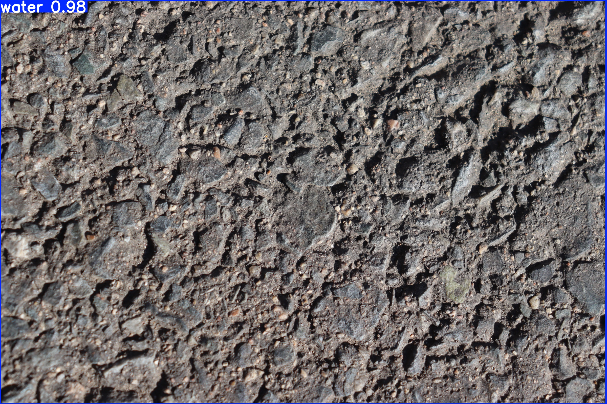
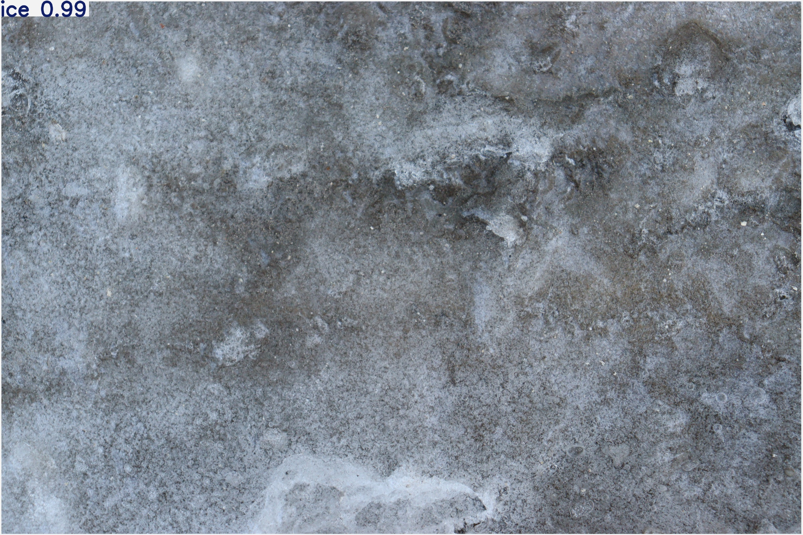
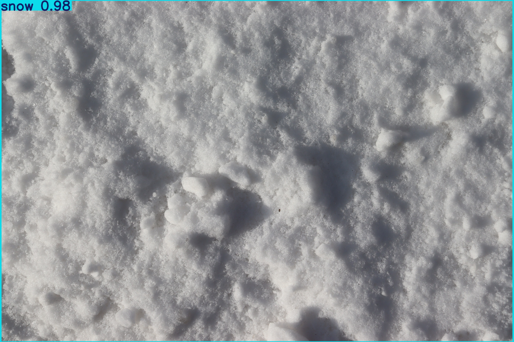
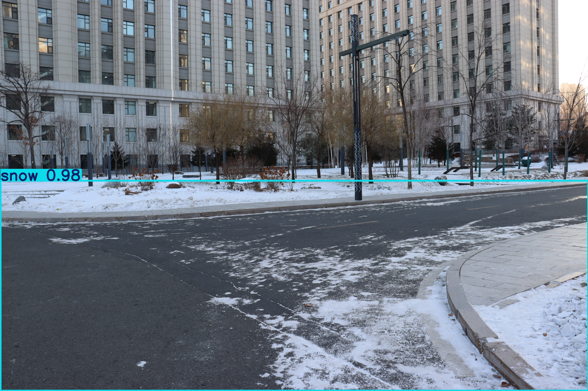
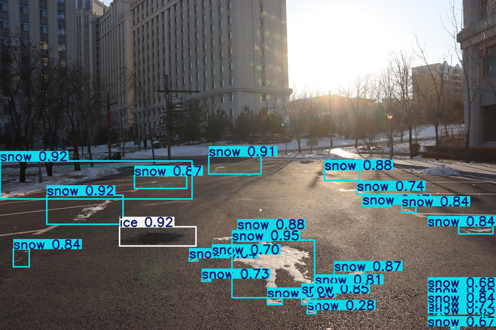
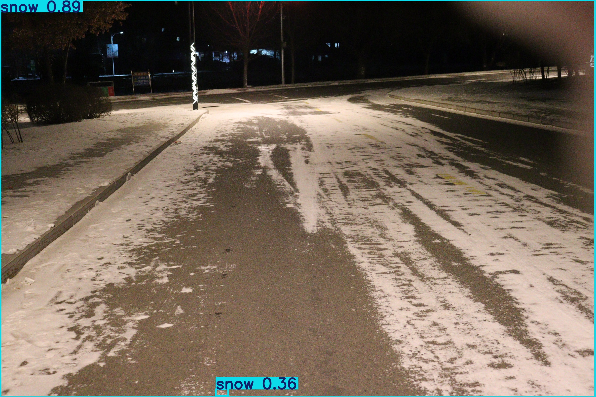
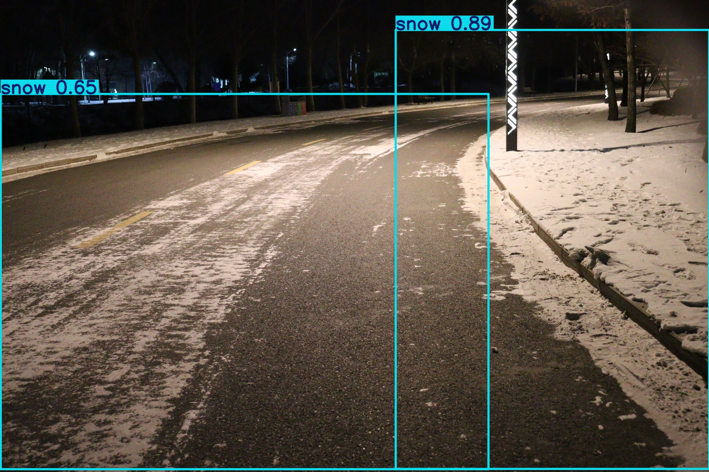
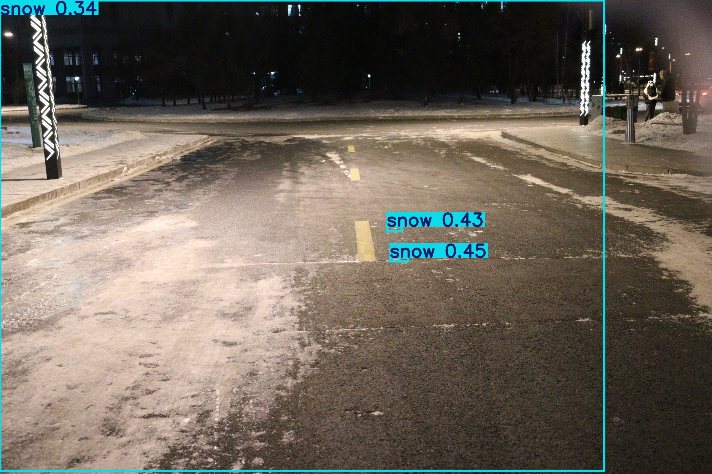

# 基于yolov8m物体检测模型的前端展示项目

## 大纲

- 基于yolov8m和机器视觉的冰雪检测模型
- 选择自动划分数据集为训练集和验证集。

## 环境配置

```bash
pip pip install -r .\requirements.txt
```

##  项目目录配置

```bash
PS D:\Program Files\road_snow> tree
卷 原神 的文件夹 PATH 列表
卷序列号为 0EDC-5FA0
D:.
├─.idea
│  └─inspectionProfiles
├─.vscode
├─training_set
│  ├─images
│  └─labels
└─yolov8n
    ├─runs
    │  └─detect
    │      └─train310
    │          └─weights
    ├─static
    │  ├─css
    │  ├─results
    │  └─uploads
    └─templates
```

## 识别对象分类

训练决定舍弃数据集中背景和干燥这两大类，只选择moist、snow和ice这三类。目的是只为识别冰雪，增强模型识别的针对性。

| 类型  | 危险指数 |
| ----- | -------- |
| moist | 低度危险 |
| snow  | 中度危险 |
| ice   | 高度危险 |

后续想增加`water `类型,指代更多的水，就是更危险的路面。

## 数据集介绍

在之前的YoloV5n模型的基础上，引入纯态数据集进行训练。纯态数据集里面包含的都是单一类型图片，就是整张图片区域都是moist、snow或ice中的一种。

### 数据集目录结构

```bash
PS D:\dataset> tree
卷 原神 的文件夹 PATH 列表
卷序列号为 0EDC-5FA0
D:.
├─my_png #自己找的一些用于测试的图片
├─PNG 
│  ├─12.01
│  └─12.02 #图片和标注图片的json文件
├─video #视频
└─纯态 
    ├─labels
    ├─冰
    ├─干燥
    ├─潮湿
    ├─积水
    └─雪
```

### `yolov8m.yaml`配置

```yaml
train: D:\Program Files\road_snow\images\train
val: D:\Program Files\road_snow\images\val
test: D:\Program Files\road_snow\images\test

# 自动划分比例（训练集:验证集）
split: [0.8, 0.2]

nc: 3  # 类别数量
names: ['water','snow','ice']  # 替换为你的类别名称

```


## 数据集标注

### 标注纯态数据集

#### 需求

- 需要为Yolo机器学习标注数据集，有以下数据集：moist 、snow和ice三种。需要实现数据集标注。返回图片对应的yolo的.txt标注文件。
- 现在有一些纯态图片，就是整张图片区域都是moist、snow或ice中的一种。

- 标注方法的话，纯态代表整张图片，所以对应的`label.txt`就是 `<class_id> 0.5 0.5 1.0 1.0`

- 再把标注过的图片移动到训练集下

  ```bash
  ├─training_set
     ├─images
     └─labels
  ```

#### 代码实现

```python
# 该脚本实现划分未标注的纯态数据集为训练集目录的功能

import os
import shutil
import random

# 定义类别和 class_id
categories = {
    "冰": 2,
    "积水": 0,
    "潮湿": 0,
    "雪": 1
}

# 原始数据目录
base_dirs = {
    "冰": r"D:\Program Files\数据集\纯态\冰",
    "积水": r"D:\Program Files\数据集\纯态\积水",
    "潮湿": r"D:\Program Files\数据集\纯态\潮湿",
    "雪": r"D:\Program Files\数据集\纯态\雪"
}

# 目标存放路径
dataset_dir = r"D:\Program Files\road_snow\training_set" #数据集绝对路径
img_dir = os.path.join(dataset_dir, "images")
label_dir = os.path.join(dataset_dir, "labels")

# 创建目录
for path in [img_dir, label_dir]:
    os.makedirs(path, exist_ok=True)

# 遍历所有类别的图片
for category, dir_path in base_dirs.items():
    class_id = categories[category]
    all_images = [f for f in os.listdir(dir_path) if f.endswith(('.jpg', '.png', '.jpeg', '.JPG', '.PNG', '.JPEG'))]

    # 处理训练集
    for filename in all_images:
        src_img_path = os.path.join(dir_path, filename)
        dst_img_path = os.path.join(img_dir, filename)

        # 复制图片
        shutil.copy(src_img_path, dst_img_path)

        # 生成标签
        label_filename = os.path.splitext(filename)[0] + ".txt"
        label_path = os.path.join(label_dir, label_filename)
        with open(label_path, "w") as f:
            f.write(f"{class_id} 0.5 0.5 1.0 1.0\n")


print("纯态数据集划分完成！")

```

### 标注普通数据集

#### 需求

- 是图片文件和它对应的json标注文件，需要把这些.json标注转为.txt。之后在分别复制到训练集下。

  ```bash
  PS D:\Program Files\数据集\PNG\12.02> ls
  
  
      目录: D:\Program Files\数据集\PNG\12.02
  
  
  Mode                 LastWriteTime         Length Name
  ----                 -------------         ------ ----
  -a----         2025/1/20     17:42        8872155 IMG_0721.json
  -a----         2025/1/20     17:44        6337944 IMG_0721.PNG
  -a----         2025/1/20     17:49        8872155 IMG_0722.json
  -a----         2025/1/20     17:48        6392482 IMG_0722.PNG
  -a----         2025/1/20     17:51        8872155 IMG_0723.json
  -a----         2025/1/20     17:46        6293090 IMG_0723.PNG
  -a----         2025/1/20     17:56        8872155 IMG_0724.json
  ......(省略)
  ```

#### 代码实现

```python
# 该脚本实现划分 将以.json格式标注过的数据集转成.txt格式 并将这些文件构建成训练目录
import os
import json
import random
import shutil

# 设置路径
image_dir = r"D:\数据集\PNG\12.02"  # 原始图片目录
label_output_dir = r"D:\Program Files\road_snow\training_set\labels"
image_output_dir = r"D:\Program Files\road_snow\training_set\images"
os.makedirs(label_output_dir, exist_ok=True)
os.makedirs(image_output_dir, exist_ok=True)
suffix_file = [".PNG",".JPG",".JPEG",".jpg",".png",".jpeg"]

# 定义类别
classes = ['water', 'snow', 'ice']

# 解析 JSON 并转换为 YOLO 格式
def convert_to_yolo(json_file, img_width, img_height):
    with open(json_file, "r") as f:
        data = json.load(f)
    
    yolo_labels = []
    for shape in data['shapes']:
        if shape['shape_type'] == 'polygon':
            label = shape['label']
            if label not in classes:
                continue
            class_id = classes.index(label)
            
            # 计算多边形的外接矩形
            points = shape['points']
            x_coords = [p[0] for p in points]
            y_coords = [p[1] for p in points]
            x_min, x_max = min(x_coords), max(x_coords)
            y_min, y_max = min(y_coords), max(y_coords)
            
            # 转换为 YOLO 格式
            x_center = (x_min + x_max) / 2 / img_width
            y_center = (y_min + y_max) / 2 / img_height
            width = (x_max - x_min) / img_width
            height = (y_max - y_min) / img_height
            yolo_labels.append(f"{class_id} {x_center} {y_center} {width} {height}")
    
    return yolo_labels

# 保存图片和标签
def save_data(img_file, labels):
    base_name = os.path.basename(img_file).replace(".PNG", "").replace(".JPG", "").replace(".jpeg", "").replace(".JPEG", "").replace(".png", "").replace(".jpg", "")
    for i in suffix_file:
        if os.path.basename(img_file).endswith(i):
            img_output_path = os.path.join(image_output_dir, f"{base_name}{i}")
            break
    label_output_path = os.path.join(label_output_dir, f"{base_name}.txt")

    with open(label_output_path, "w") as f:
        f.write("\n".join(labels))

    # 复制图片
    shutil.copy(img_file, img_output_path)

# 获取所有图片文件
image_paths = []
for img_file in os.listdir(image_dir):
    for i in suffix_file:
        if img_file.endswith(i):
            json_file = os.path.join(image_dir, img_file.replace(".PNG", ".json").replace(".JPG", ".json").replace(".jpeg", ".json").replace(".JPEG", ".json").replace(".png", ".json").replace(".jpg", ".json"))
            if os.path.exists(json_file):#如果存在对应的json则操作
                # 假设图片分辨率为 2400x1600，可以根据实际情况调整
                img_width, img_height = 2400, 1600
                labels = convert_to_yolo(json_file, img_width, img_height)
                save_data(os.path.join(image_dir, img_file), labels)
                image_paths.append(os.path.join(image_output_dir, img_file))
        break

'''
# 手动划分训练集和验证集
random.shuffle(image_paths)
split_idx = int(len(image_paths) * 0.8)
train_imgs, val_imgs = image_paths[:split_idx], image_paths[split_idx:]

# 创建训练集和验证集目录
train_dir = os.path.join(image_output_dir, "train")
val_dir = os.path.join(image_output_dir, "val")
os.makedirs(train_dir, exist_ok=True)
os.makedirs(val_dir, exist_ok=True)

# 移动文件
for img_file in train_imgs:
    shutil.move(img_file, os.path.join(train_dir, os.path.basename(img_file)))

for img_file in val_imgs:
    shutil.move(img_file, os.path.join(val_dir, os.path.basename(img_file)))
'''
print("数据集划分完成！")

```


## 模型训练

创建训练目录`yolov8m`，在该目录下创建`train.py`文件

```python
import torch
from ultralytics import YOLO

# 加载预训练的 YOLOv8 模型
model = YOLO(r"D:\Program Files\road_snow\yolov8n\yolov8m.pt")  # 这里可以根据你的需求替换为其他版本的 YOLO 模型

# 配置训练参数
train_args = {
    'data': 'yolov8m.yaml',  # 数据集配置文件路径
    'epochs': 300,  # 训练的轮数
    'batch': 16,  # 每个批次的大小
    'imgsz': 640,  # 输入图像的大小
    'device': 'cuda',  # 使用 GPU 训练，如果没有 GPU 可以改为 'cpu'
    'project': 'runs/detect',  # 存储训练结果的目录
    'name': 'train3',  # 训练结果保存的子目录
    'save': True,  # 是否保存模型
    'save_period': -1,  # 每隔多少轮保存一次模型
    'verbose': True,  # 是否打印详细日志
    'workers': 0,  # 数据加载器的工作线程数
    'optimizer': 'AdamW',  # 使用自动优化器（Adam 或 SGD）
    'lr0': 0.003,  # 初始学习率
    'lrf': 0.2,  # 学习率衰减率
    'warmup_epochs': 7,  # 预热的轮数
    'box': 7.5,  # 训练的框回归损失权重
    'cls': 0.5,  # 类别损失权重
    'dfl': 1.5,  # 关键点损失权重
    'pose': 12.0,  # 姿态估计损失权重
    'nbs': 64,  # 批次大小
    'freeze' : 10,  # 冻结训练的层数
    'split': "0.8 0.2 "  # 训练集和验证集的比例
}
# 打印训练参数
print(train_args)


# 训练模型
train_results = model.train(**train_args)

# 输出训练结果
print(train_results)
```

### 训练参数打印

```bash
engine\trainer: 
task=detect
mode=train
model=D:\Program Files\road_snow\yolov8n\yolov8m.pt
data=yolov8m.yaml
epochs=300
time=None
patience=100
batch=16
imgsz=640
save=True
save_period=-1
cache=False
device=cuda
workers=0
project=runs/detect
name=train32
exist_ok=False
pretrained=True
optimizer=AdamW
verbose=True
seed=0
deterministic=True
single_cls=False
rect=False
cos_lr=False
close_mosaic=10
resume=False
amp=True
fraction=1.0
profile=False
freeze=10
multi_scale=False
overlap_mask=True
mask_ratio=4
dropout=0.0
val=True
split=0.8 0.2
save_json=False
save_hybrid=False
conf=None
iou=0.7
max_det=300
half=False
dnn=False
plots=True
source=None
vid_stride=1
stream_buffer=False
visualize=False
augment=False
agnostic_nms=False
classes=None
retina_masks=False
embed=None
show=False
save_frames=False
save_txt=False
save_conf=False
save_crop=False
show_labels=True
show_conf=True
show_boxes=True
line_width=None
format=torchscript
keras=False
optimize=False
int8=False
dynamic=False
simplify=True
opset=None
workspace=None
nms=False
lr0=0.003
lrf=0.2
momentum=0.937
weight_decay=0.0005
warmup_epochs=7
warmup_momentum=0.8
warmup_bias_lr=0.1
box=7.5
cls=0.5
dfl=1.5
pose=12.0
kobj=1.0
nbs=64
hsv_h=0.015
hsv_s=0.7
hsv_v=0.4
degrees=0.0
translate=0.1
scale=0.5
shear=0.0
perspective=0.0
flipud=0.0
fliplr=0.5
bgr=0.0
mosaic=1.0
mixup=0.0
copy_paste=0.0
copy_paste_mode=flip
auto_augment=randaugment
erasing=0.4
crop_fraction=1.0
cfg=None
tracker=botsort.yaml
save_dir=runs\detect\train32
```


## 模型评估与优化

### 效果图展示


















## 危险评估算法设计

日后的工作

## 前端展示代码

### 源代码

`static/css/styles.css`

```css
body {
    font-family: Arial, sans-serif;
    text-align: center;
    padding: 20px;
    background-color: #f4f4f9;
}

.container {
    max-width: 600px;
    margin: auto;
    background: #fff;
    padding: 20px;
    border-radius: 8px;
    box-shadow: 0 0 10px rgba(0, 0, 0, 0.1);
}

h1 {
    margin-bottom: 20px;
}

button {
    margin-top: 10px;
    padding: 10px 20px;
    background-color: #007bff;
    color: #fff;
    border: none;
    border-radius: 4px;
    cursor: pointer;
}

button:hover {
    background-color: #0056b3;
}

#result img, #result video {
    margin-top: 20px;
}
```

`templates/index.html`

```html
<!DOCTYPE html>
<html lang="en">
<head>
    <meta charset="UTF-8">
    <meta name="viewport" content="width=device-width, initial-scale=1.0">
    <link rel="stylesheet" href="/static/css/styles.css">
    <title>YOLOv8 Object Detection</title>
</head>
<body>
    <div class="container">
        <h1>YOLOv8 Object Detection</h1>
        <form id="upload-form">
            <input type="file" id="file" name="file" accept="image/*,video/*" required>
            <button type="submit">Upload and Predict</button>
        </form>
        <div id="result">
            <h2>Prediction Result:</h2>
            
            <video id="result-video" controls style="max-width: 100%; display: none;"></video>
        </div>
    </div>

    <script>
        const form = document.getElementById('upload-form');
        const resultImage = document.getElementById('result-image');
        const resultVideo = document.getElementById('result-video');
    
        form.addEventListener('submit', async (e) => {
            e.preventDefault();
            const fileInput = document.getElementById('file');
            const file = fileInput.files[0];
    
            if (!file) return alert('Please select a file.');
    
            const formData = new FormData();
            formData.append('file', file);
    
            try {
                const response = await fetch('/upload', {
                    method: 'POST',
                    body: formData,
                });
                
                if (!response.ok) {
                    throw new Error(`HTTP error! status: ${response.status}`);
                }
    
                const result = await response.json();
    
                if (result.error) {
                    alert(result.error);
                    return;
                }
    
                // 添加时间戳避免缓存问题
                const timestamp = new Date().getTime();
                const resultPath = `${result.result}?t=${timestamp}`;
    
                if (file.type.startsWith('image/')) {
                    resultImage.src = resultPath;
                    resultImage.style.display = 'block';
                    resultVideo.style.display = 'none';
                    resultVideo.src = ''; // 清除视频源
                } else if (file.type.startsWith('video/')) {
                    resultVideo.src = resultPath;
                    resultVideo.style.display = 'block';
                    resultImage.style.display = 'none';
                    resultImage.src = ''; // 清除图片源
                    resultVideo.load(); // 重新加载视频
                }
            } catch (error) {
                console.error('Error:', error);
                alert('Prediction failed: ' + error.message);
            }
        });
    </script>
</body>
</html>

```

`yolov8n/app.py`

```python
from flask import Flask, request, render_template, send_from_directory, jsonify
import os
from ultralytics import YOLO
from werkzeug.utils import secure_filename
import subprocess

app = Flask(__name__)
app.config['UPLOAD_FOLDER'] = 'static/uploads'
app.config['RESULTS_FOLDER'] = 'static/results'

# 确保文件夹存在
os.makedirs(app.config['UPLOAD_FOLDER'], exist_ok=True)
os.makedirs(app.config['RESULTS_FOLDER'], exist_ok=True)


@app.route('/')
def index():
    return render_template('index.html')


def predict_yolov8(input_path, file):
    try:
        model = YOLO(r'D:\Program Files\road_snow\yolov8n\runs\detect\train310\weights\best.pt')
        results = model.predict(
            source=input_path,
            project=app.config['RESULTS_FOLDER'],
            name=os.path.splitext(file.filename)[0],
            save=True,
            exist_ok=True
        )

        result_dir = str(results[0].save_dir)
        result_files = [f for f in os.listdir(result_dir) if f.endswith(('.avi', '.jpg', '.png'))]

        if not result_files:
            raise RuntimeError("No output file generated.")

        result_filename = result_files[0]

        # 确保 ffmpeg 在系统 PATH 中
        if result_filename.endswith('.avi'):
            result_filename_mp4 = os.path.splitext(result_filename)[0] + '.mp4'
            avi_path = os.path.join(result_dir, result_filename)
            mp4_path = os.path.join(result_dir, result_filename_mp4)

            # 调用 ffmpeg 进行转换
            subprocess.run(['ffmpeg', '-i', avi_path, '-vcodec', 'libx264', '-crf', '23', '-preset', 'fast', mp4_path], check=True)

            os.remove(avi_path)  # 删除原 .avi 文件
            result_filename = result_filename_mp4

        print(f"Result saved to: {result_dir}\\{result_filename}")
        return f'/static/results/{os.path.basename(result_dir)}/{result_filename}'

    except Exception as e:
        print(f"Error in predict_yolov8: {str(e)}")
        return None


@app.route('/upload', methods=['POST'])
def upload_file():
    if 'file' not in request.files:
        return jsonify({'error': 'No file uploaded'}), 400

    file = request.files['file']
    if file.filename == '':
        return jsonify({'error': 'No selected file'}), 400

    # 安全处理文件名
    filename = secure_filename(file.filename)
    input_path = os.path.join(app.config['UPLOAD_FOLDER'], filename)

    try:
        file.save(input_path)
        result_url = predict_yolov8(input_path, file)

        if not result_url:
            return jsonify({'error': 'Prediction failed'}), 500

        return jsonify({'result': result_url})

    except Exception as e:
        print(f"Error in upload_file: {str(e)}")
        return jsonify({'error': str(e)}), 500


@app.route('/static/<path:path>')
def serve_static(path):
    return send_from_directory('static', path)


if __name__ == '__main__':
    app.run(debug=True, host='0.0.0.0', port=5000)

```

直接运行

```
python app.py
```

即可在`http://127.0.0.1:5000/`与前端交互
